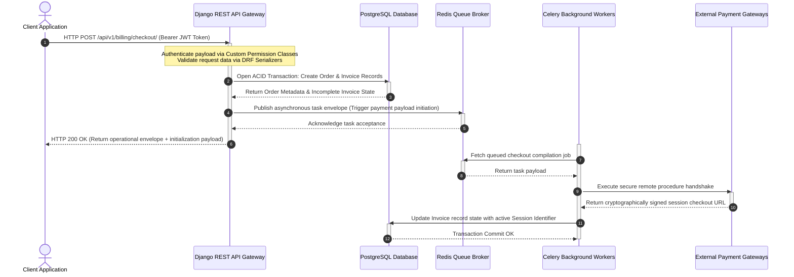

# Basic System Architecture Design Specification

## 1. System Topology & Architectural Pattern

The ecosystem employs a decoupled, Monolithic API backend with a Multi-Frontend Architecture. It uses an asynchronous event-driven design for non-blocking processes (Example : Mail Dispatch, 4W Audit Logging, Payment Webhook Processing).

| Component               | Technology                     | Paradigm / Pattern                                         | Operational Role                                                                                            |
|-------------------------|--------------------------------|------------------------------------------------------------|-------------------------------------------------------------------------------------------------------------|
| Backend Core            | Python / Django REST Framework | MVC / Monolithic API / Service Layer                       | Central data validation, business logic orchestration, database transaction boundary, security enforcement. |
| Web Frontend            | NextJS / TypeScript           | Server-Side Rendering (SSR) & Static Site Generation (SSG) | Public marketing website, SEO optimization and hydration of authenticated client-side portals (Student, Teacher, Staff, Administrator).                     |
| Mobile Frontend         | React Native / Expo            | Native Client Application                                  | Cross-platform student LMS portal optimized for smartphones with offline asset caching capabilities.                                  |
| Database Engine         | PostgreSQL                     | Relational Model / ACID Compliant                          | Persistent single source of truth using clean logical schemas / prefixes to segregate domain boundaries.            |
| Asynchronous Task Queue | Celery + Redis                 | Publisher-Subscriber / Worker Pattern                      | Processing resource-intensive background tasks, webhook processing and transactional notifications.        |

---

## 2. Cross-Phase Domain Boundaries & Database Layout

To prevent monolithic coupling while maintaining a single source of truth across the distinct implementation phases, the database relies on strict logical domain boundaries.

| Domain Namespace           | Underlying Entities / Models                                  | Target Lifecycle Phase     | Coupling & Dependencies                                                          |
|----------------------------|---------------------------------------------------------------|----------------------------|----------------------------------------------------------------------------------|
| Identity & Access (Administrator)    | User, Role, Permission, Session, AuditLog                     | Phase 1.1 (CMS Foundations) | **Administrative Backbone** : Provides secure authentication, session management and 4W audit tracking for staff members modifying public content. Enforces single active sessions.                  |
| Content & Public Relations | Page, Faculty, Alumni, PrizeWinner, Partner, ContactRequest   | Phase 1.1 (CMS of Public Website)   | **Public Website Engine** : Backs all dynamic elements of the public-facing platform managed via the **Phase 1.1 CMS**. Dependent solely on IAM for administrative management.                           |
| Learning Management (LMS)  | Course, Module, Lecture, MCQGate, Enrollment, ProgressTracking | Phase 2 (LMS Platform)     | **Student LMS** : Extends the `iam_*` system to manage student portal access, sequential curriculum progression and gate states. Deeply coupled with Core Billing Module.                    |
| Billing & Finance          | Transaction, Invoice, SSLCommerzLog, LedgerAccount            | Phase 2 & Phase 3          | **Payment Ingestion** : Maps course registrations directly to transactional ledgers prior to financial processing. Logs local Gateways (SSLCommerz, bKash).                     |
| Enterprise Resource (ERP)  | StaffProfile, Expense, Asset, ProcurementOrder, CRMLead                | Phase 3 (ERP / CRM / SCM Suite)  | **Internal ERP / CRM / SCM** : Drives the corporate dashboard, tracking institutional overhead, procurement pipelines and prospective leads. Extends IAM. |

---

## 3. High-Level Communication & Data Flow Protocol

---

## 4. Multi-Tenant Role & Access Control Matrix

Enforced via custom Django REST Framework permission classes analyzing JWT session payloads passed via secure, encrypted channels.

| System Role    | Permitted Domain Operations                                                                                              | Authentication Factors         | Interface Boundary                   |
|----------------|--------------------------------------------------------------------------------------------------------------------------|--------------------------------|--------------------------------------|
| Public Visitor | Read public content, view outlines, submit contact forms, view Alumni / Prize Winners, register.                           | None (Anonymous Session)       | NextJS Public Web Application               |
| Student        | Read enrolled modules, attempt MCQ Gates, view invoices, access Job Placement Support, engage with 24h Forum / AI Support. | JWT + Secure HttpOnly Cookie   | NextJS Student Portal / Expo Mobile |
| Teacher        | Grade assignments, update course syllabi, view student progress analytics.                                               | JWT + Secure HttpOnly Cookie   | NextJS Teacher Portal               |
| Staff Member   | Review CRM leads, manage full student lifecycle states, process procurement, log administrative expenses.                | JWT + Multi-Factor Authentication (MFA) | NextJS Staff Dashboard              |
| Administrator  | Manage platform state, override system configurations, export financial ledgers (PDF / Excel), inspect audit logs.                | JWT + Hardware MFA             | NextJS Admin Suite                  |

---

## 5. Security Architecture & Resiliency Baselines

| Vector / Component    | Mitigation Mechanism              | Implementation Specifics                                                                                                                                                     |
|-----------------------|-----------------------------------|------------------------------------------------------------------------------------------------------------------------------------------------------------------------------|
| Session Hijacking     | Single Active Session Enforcement | Custom middleware cross-checks incoming request session tokens against an in-memory Redis-backed token blacklist store on every transaction.                                 |
| Brute Force Attacks   | Account Lockout Policy            | Post 5 failed consecutive authentication attempts, account state is marked locked; triggers a time-sensitive, cryptographically signed self-service unlock email via Celery. |
| Data Ingestion Risks  | Strict Schema Validation          | Request bodies are parsed through DRF Serializers with explicit typing, strict regex matches and zero raw SQL execution to prevent injection.                               |
| Data in Transit       | Network Layer Security            | HSTS enabled globally; TLS 1.3 mandated across all communication paths; API routes configure Strict CORS origins matching only validated web domains.                        |
| Data at Rest          | Storage Encryption                | PostgreSQL cluster utilizes Transparent Data Encryption (TDE) or underlying cloud storage block encryption using AES-256 keys.                                               |
| Operational Integrity | 4W Comprehensive Audit Logging    | Middleware captures **Who** (User ID / Role), **When** (Timestamp), **Where** (IP / User-Agent) and **What** (Resource URI / Method / Status) for mutating states into a write-once log partition.  |