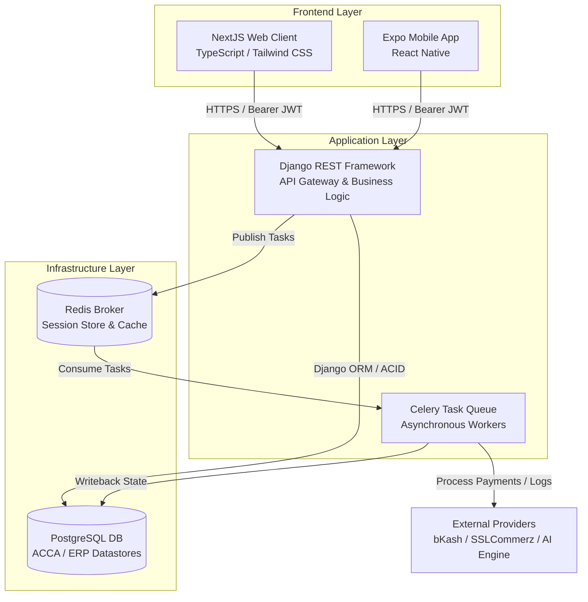

# Basic Technology Stack Specification

This specification outlines the concrete technical architecture, language runtimes, core frameworks, utility modules and dependency configurations for the HeadStart digital ecosystem. It establishes the technical implementation rules for scaffolding the platform by cloning the [PEND Boilerplate](https://github.com/corebit-bd/pend-boilerplate).

## 1. Core Technology Alignment Matrix

The ecosystem utilizes a decoupled, Monolithic API backend with a Multi-Frontend Architecture. It relies strictly on custom, hard-coded components built from scratch to preserve absolute structural control and meet performance requirements across all target portals. 

> Version baselines are defined as semver constraints to permit automatic security patches via Dependabot while enforcing major architectural compatibility floors.

| Tier                  | Component                   | Technology Selection                 | Version Constraint Baseline | Architectural Rationale                                                                                                                                                                                             |
|-----------------------|-----------------------------|--------------------------------------|-----------------------------|---------------------------------------------------------------------------------------------------------------------------------------------------------------------------------------------------------------------|
| Backend               | API Gateway & Core Engine   | Python / Django REST Framework (DRF) | `3.12.x LTS` / `5.0.x LTS`      | Provides a robust, secure Object-Relational Mapping (ORM) framework, built-in cryptographic security modules, strict session enforcement mechanisms and enterprise data validation via DRF Serializers.            |
| Frontend (Web)        | Public Engine & Portals     | NextJS / TypeScript / Tailwind CSS  | `^14.0.0` / `^5.0.0` / `^3.4.0`   | Enables hybrid Server-Side Rendering (SSR) for the public SEO marketing layout, Static Site Generation (SSG) for dynamic performance profiles and secure client-side state hydration for authenticated dashboards. |
| Frontend (Mobile)     | Native App Portal           | React Native / Expo                  | `^0.74.0` / `SDK 51.x`          | Facilitates cross-platform compilation (iOS and Android) for the student LMS portal with native hardware caching mechanics and mobile-responsive UI structures.                                                     |
| Database              | Persistent Relational Store | PostgreSQL                           | `16.x LTS`                    | Offers ACID-compliant data consistency, complex analytical relational querying, row-level locking and structured indexing for the multi-phase database boundaries.                                                 |
| Caching & Asynchronous Queue | Task Broker & Session Cache | Redis + Celery                       | `7.2.x LTS` / `^5.4.0`          | Handles asynchronous event-driven task distribution, non-blocking webhook ingestion (SSLCommerz / bKash) and high-throughput session state caching.                                                                  |

---

## 2. Comprehensive Tooling & Engineering Blueprint

### 2.1 Backend Core Specification (Python / Django REST Framework)

The backend functions as a headless, state-enforced JSON API Engine. All routes are prefixed with versioning boundaries (`/api/v1/`).

- **Authentication & Session Architecture** : Implements custom JWT evaluation layers passed securely via `HttpOnly`, `Secure`, `SameSite=Strict` cookies for web clients and signed header payloads for the mobile runtime. Single Active Session validation occurs via a custom middleware layer executing against the Redis session store on every mutating database hit.

- **Data Validation & Processing** : Data ingestion parses strictly through DRF Serializers or native Pydantic schemas. Raw SQL executions are prohibited; all domain operations utilize the Django ORM to protect against injection risks.

- **Background Processing Engine** : The Celery framework acts as the asynchronous event-driven processor. It decouples resource-intensive functions — such as transactional confirmation emails, automated SMS notifications, bKash / SSLCommerz Instant Payment Notifications (IPN) and 4W audit logging operations — from the request-response thread lifecycle.

### 2.2 Web Frontend Specification (NextJS / TypeScript)

The web application consolidates public views and internal operation dashboards into a single, unified codebase partitioned into logical layout routes.

- **Design Implementation Strategy** : Adhering to a strict engineering design policy, all structural components (buttons, navigation elements, inputs, multi-level menus, responsive tabs) are hard-coded from scratch using native Tailwind utility classes. Third-party visual UI toolkits are excluded to minimize dependency risks and optimize runtime speeds.

- **State Management & Networking** : Communication with the backend relies on typed Axios instances configuring global interceptors. These interceptors capture network dropouts, handle automatic token regeneration and transform incoming standard envelope data into defined TypeScript types. Client state uses localized React Context boundaries for user session details and temporary operational queues.

- **Rendering Optimizations** : Public marketing pages (`/about`, `/courses`, `/alumni`) use aggressive Server-Side Rendering (SSR) and Incremental Static Regeneration (ISR) to satisfy Core Web Vitals, maximize SEO page rankings and load assets instantly for users on low-bandwidth mobile networks.

### 2.3 Mobile Frontend Specification (React Native / Expo)

The mobile application functions as a native, performance-optimized, smartphone-centric container specifically engineered for the Student LMS Portal.

- **Navigation & User Interface** : Incorporates Expo Router to achieve cross-platform file-based navigation structures. The visual layouts map closely to the core web component architecture, utilizing hard-coded flex structures optimized for lower-tier Android and iOS mobile displays.

- **Asset & Course Caching** : Uses `Expo FileSystem` and SQLite storage structures to safely cache text lectures, course module outlines, student exam results and user profile data directly onto local device memory. This structure minimizes cellular data use across Bangladesh’s regional networks.

- **Network Handshaking** : Implements an offline-aware tracking mechanism. If a student attempts an MCQ gating quiz while disconnected, the client retains the localized response state and syncs the data envelope with the Django REST backend immediately upon network restoration.

---

## 3. Database Schema & Prefixed Modular Layout

The unified PostgreSQL database cluster segregates system modules cleanly through table prefixing conventions. This design maintains strict separation of concerns across development phases while allowing unified transactional integrity across modules when needed.

| Phase Allocation | Domain Namespace    | Table Prefix | Representative Models & Tables                                           | Purpose & Isolation Boundaries                                                                                                          |
|------------------|---------------------|--------------|--------------------------------------------------------------------------|-----------------------------------------------------------------------------------------------------------------------------------------|
| Phase 1.1          | Identity & Access (Administrator)   | `iam_*`        | `iam_user`, `iam_role`, `iam_session`, `iam_audit_log`           | **Administrative Backbone** : Provides secure authentication, session management and 4W audit tracking for staff members modifying public content. |
| Phase 1.1          | Content Management (CMS)  | `cms_*`        | `cms_page`, `cms_faculty`, `cms_alumni`, `cms_prize_winner`, `cms_contact`         | **Public Website Engine** : Backs all dynamic elements of the public-facing platform (teacher directories, success stories and forms) managed via the Phase 1.1 CMS.               |
| Phase 2          | Learning Management | `lms_*`        | `lms_course`, `lms_module`, `lms_lecture`, `lms_mcq_gate`, `lms_enrollment`         | **Student LMS** : Extends the `iam_*` system to manage student portal access, sequential curriculum progression and gate states.  |
| Phase 2          | Billing & Payments  | `bil_*`        | `bil_transaction`, `bil_invoice`, `bil_sslcommerz_log`, `bil_bkash_log`          | **Payment Ingestion** : Maps course registrations directly to transactional ledgers prior to financial processing. |
| Phase 3          | Enterprise Resource | `erp_*`        | `erp_staff_profile`, `erp_expense`, `erp_asset`, `erp_procurement`, `erp_crm_lead` | **Internal ERP / CRM** : Drives the corporate dashboard, tracking institutional overhead, procurement pipelines and prospective leads.         |

---

## 4. Typography & Interface Constraints

The UI implementation must reflect the typography rules, spacing standards and design metrics verified in the core style guide.

| Design Category | Parameter              | Target Core Specification   | Implementation Directives                                                                                                                                                                                 |
|-----------------|------------------------|-----------------------------|-----------------------------------------------------------------------------------------------------------------------------------------------------------------------------------------------------------|
| **Typography**      | Branding & Logos       | **Montserrat**                  | Used for page titles, landing headlines, logo representations and key high-visibility CTA interfaces.                                                                                                    |
| **Typography**      | Interface UI & Body    | **Inter**                       | Used for all interactive buttons, form elements, dashboard tables, forum entries and standard reading text.                                                                                              |
| **Spacing System**  | Base Scale Hierarchy   | **4-Point Grid System**         | Layout margins, padding and positioning elements must scale incrementally by **4px** base multiples (`space-0` to `space-8`).                                                                                    |
| **Borders & Radius** | Corner Rounding Scale  | **4px / 8px / 16px**            | Input borders/tags use 4px (`radius-sm`). Buttons / cards use 8px (`radius-md`). Dialog overlays and modals use 16px (`radius-lg`).                                                                               |
| **Accessibility**   | Minimum Color Contrast | **WCAG 2.1 Level AA Compliant** | Text elements must meet a contrast ratio of 4.5:1 for standard UI elements and 3:1 for large text/icons. Brand accents like Gold (`#FEE054`) are reserved strictly for backgrounds with dark text overlays. |

---

## 5. Security & Architectural Compliance Baselines

- **Strict 4W Audit Logging** : Every transaction that mutates data within the Django API backend must pass through a logging middleware. This service records data matching the 4W structure (**Who** initiated the operation, **When** the transaction took place, **Where** the request originated via IP / User-Agent and **What** specific resource route was touched). These entries are written to an isolated partition in the `iam_audit_log` table.

- **Automated Account Lockout Rules** : If an individual inputs 5 incorrect authentication payloads within a rolling time window, the system updates the target user profile state to locked. The backend then issues a cryptographically signed, expiration-capped account recovery link via a Celery mail worker thread.

- **Cross-Origin Resource Sharing (CORS)** : NextJS frontend deployments utilize production origin domain locks within the Django settings environment. Wildcard configurations (`*`) are disallowed across all production routes.

- **Database Protection Boundaries** : Development practices enforce strict parametrization across all data ingestion flows. Raw text concatenation for queries is blocked across all service modules, eliminating potential SQL injection vectors. All storage drives use AES-256 block-level encryption when writing cold data records to disks at rest.