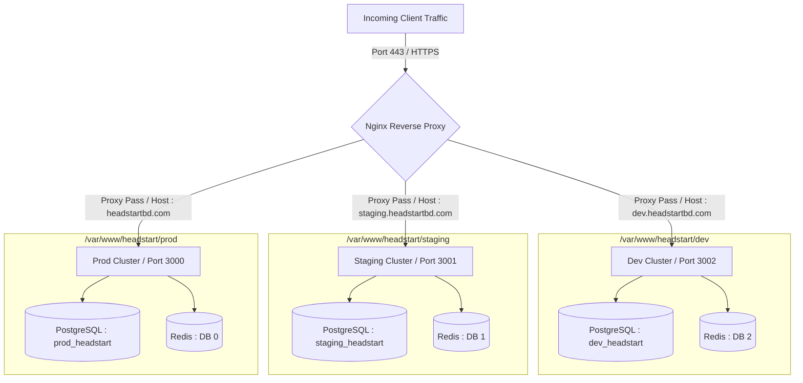
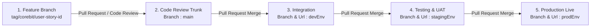

# Multiple Environments Design Specification

This specification establishes the structural configuration, deployment mapping and lifecycle environment workflow rules for the HeadStart ecosystem. It ensures complete isolation between development, staging and production states hosted across Hostinger Virtual Private Servers (VPS).

## 1. Multi-Environment Architecture Layout

The infrastructure splits the Hostinger VPS into three distinctly isolated system boundaries residing on local system paths, each operating on individual target container ports and domain boundaries.

| Environment          | System Workspace Path      | Exposed Port | Dedicated Target URL                                               | Operational Strategy & Strict Purpose                                                                                                              |
|----------------------|----------------------------|--------------|--------------------------------------------------------------------|----------------------------------------------------------------------------------------------------------------------------------------------------|
| Development (`devEnv`) | `/var/www/headstart/dev`     | `3002`         | [https://dev.headstartbd.com](https://dev.headstartbd.com)         | Automated integration testing for merged features. Simulates dynamic localized behaviors and unstable feature sandboxing.                          |
| Staging (`stagingEnv`) | `/var/www/headstart/staging` | `3001`         | [https://staging.headstartbd.com](https://staging.headstartbd.com) | Mirror image of production configuration. Used for user acceptance testing (UAT), payment gateway sandboxing and performance pre-flight checks.   |
| Production (`prodEnv`) | `/var/www/headstart/prod`    | `3000`         | [https://headstartbd.com](https://headstartbd.com)                 | Safe, low-latency, highly optimized environment serving active students, faculty and corporate operators. High-integrity state constraints apply. |

---

## 2. Infrastructure Architecture & Data Isolation Blueprint

---

## 3. The High-Integrity Workflow Mapping

To safeguard core system frameworks, changes must pass sequentially through the continuous promotion lifecycle. Direct commits to `main`, `devEnv`, `stagingEnv` or `prodEnv` are strictly blocked via GitHub branch protection rules.

### 3.1 Step-by-Step Release Promotion Protocol

- **Feature Phase** : Engineering occurs strictly on localized developer hardware within branches adhering to the naming standard : `tag/corebit/user-story-id`. Testing runs against local SQLite or Dockerized temporary datastores.

- **Review Phase** : Developers open a Pull Request (PR) targeting the `main` branch. Automated continuous integration linting, typing checks and open-source PEND security dependency scans evaluate the changes. At least one peer review approval is required before merging.

- **Integration Phase (`devEnv`)** : Merging into `main` allows code integration via PR to the target `devEnv` tracking branch. Successful merges trigger GitHub actions to securely connect to Hostinger VPS via SSH, pull files into `/var/www/headstart/dev`, run database migrations and hot-reload node processors running on port `3002`.

- **Testing Phase (`stagingEnv`)** : Once validated on `dev.headstartbd.com`, code is pushed via PR from `devEnv` into `stagingEnv`. This deployment moves code to `/var/www/headstart/staging` running on port `3001`. It acts as the definitive confirmation environment utilizing mock payment endpoints for bKash and SSLCommerz.

- **Live Phase (`prodEnv`)** : Upon smoke test approval, a final production PR promotes changes from `stagingEnv` to `prodEnv`, triggering updates in the live system workspace `/var/www/headstart/prod` on port `3000`.

---

## 4. Multi-Phase Multi-Environment Evolution Matrix

Environmental configuration requirements scale as the ecosystem expands across implementation phases.

| Environmental Domain        | Phase 1 & Phase 1.1 (Public Website / CMS)                                                                                        | Phase 2 (LMS & Payment Engine)                                                                                        | Phase 3 (ERP + CRM + SCM Suite)                                                                                     |
|-----------------------------|-----------------------------------------------------------------------------------------------------------------------|-----------------------------------------------------------------------------------------------------------------------|--------------------------------------------------------------------------------------------------------------------|
| Database Strategy           | Single Hostinger Postgres engine containing three isolated target schemas (`dev`, `staging`, `prod`) to prevent data bleed. | Dedicated, structurally detached database clusters mapping distinct data pipelines per lifecycle path.                | Strict row-level encryption and automated cold backups mapping live tables to an offsite secure instance daily.    |
| Third-Party Handshakes      | Mock client parameters or sandboxed testing tokens for contact requests and analytics tracking engines.               | bKash / SSLCommerz Sandbox integration mapped on `dev` and `staging`; live credentials locked inside `prodEnv`.             | CRM webhook routes pointing to decoupled sandbox instances; external ledger synchronization limited to production. |
| Asynchronous Infrastructure | Local processing for basic email contact logs; Redis database separations handle routine worker tasks.                | Celery processing pools explicitly decoupled per directory pathway using dedicated queues (`dev_q`, `staging_q`, `prod_q`). | Full physical task separation; multi-tenant queue workers restricted to isolated sub-threading blocks.             |

---

## 5. Security & Configuration Enforcement Rules

- **Runtime Secrets Storage Management** : Storing configuration parameters, database credentials and secret security signatures inside code repositories is prohibited. Environments read states entirely via local system `.env` configurations residing within targeted workspaces on the Hostinger VPS.

- **Nginx Reverse Proxy Infrastructure** : The Hostinger boundary exposes ports `80` and `443` externally. An Nginx engine serves as the main entry checkpoint, using server names (`headstartbd.com`, `staging.headstartbd.com`, `dev.headstartbd.com`) to route requests to local ports `3000`, `3001` and `3002`.

- **Database Schema Migrations Protocol** : Schema modifications execute systematically across target endpoints. Database mutations run first on `devEnv`, verify operation runtimes on `stagingEnv` and apply to `prodEnv` only during scheduled off-peak maintenance hours.

- **Automated State Backups Execution** : The production runtime database instance (`/var/www/headstart/prod`) executes an automated `pg_dump` sequence every 24 hours. The resulting state snapshots are compressed, encrypted using AES-256 keys and moved to secure secondary storage boundaries to ensure multi-point fallback reliability.