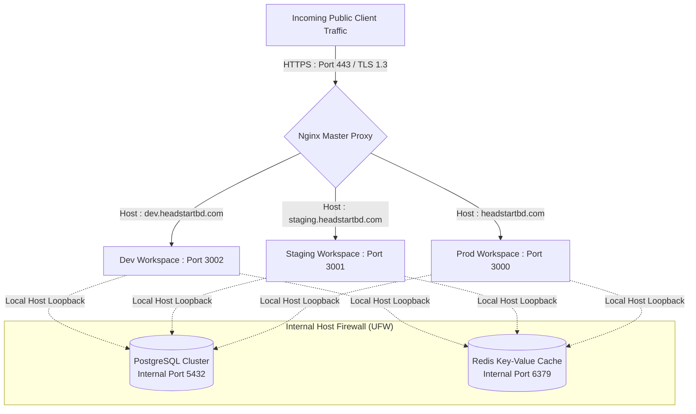

# Basic Infrastructure Design Specification

This specification defines the hosting environments, network configurations, service boundaries and process layouts for the HeadStart system. It establishes the baseline infrastructure requirements for running the decoupled, Monolithic API backend and Multi-Frontend Architecture on a single Hostinger Virtual Private Server (VPS).

## 1. Physical Hardware & Infrastructure Topology

The system uses a single Hostinger Linux VPS instance as a virtualized bare-metal container to isolate development, staging and production application workloads.

| Layer Element        | Target Virtual Engine Allocation         | Infrastructure Operation Strategy                                                                                   |
|----------------------|------------------------------------------|---------------------------------------------------------------------------------------------------------------------|
| Virtual Server Host  | Hostinger VPS KVM Instance               | Linux OS base providing kernel-level network routing, process trees and logical path security.                     |
| Reverse Proxy        | Nginx Open Source Server                 | Ingests external traffic on public ports `80` (HTTP) and `443` (HTTPS) and passes it to internal application instances. |
| Application Runtimes | NodeJS PM2 Node Pools & Python Gunicorn | Local system runtime environments that host isolated frontend builds and backend server instances.                  |
| Database Engines     | PostgreSQL 16 Cluster + Redis Server     | Persistent data stores and in-memory key-value databases running on standard internal ports.                        |

---

## 2. Global Network Topology & Port Mapping Blueprint



---

## 3. High-Integrity Workspace Partitioning

To prevent data bleed and process cross-contamination, the Hostinger VPS partitions environment runtime zones strictly by filesystem path boundaries.

### 3.1 Development Workspace (`/var/www/headstart/dev`)

- **Target Exposed Port** : `3002`

- **Database Partition** : Dedicated PostgreSQL database `dev_headstart` using isolated tables and migrations.

- **Cache Space** : Redis logical index database storage mapping (`DB 2`).

- **Process Supervisor ID** : Managed via a standalone PM2 / Gunicorn entry namespace prefixed as `headstart-dev`.

### 3.2 Staging Workspace (`/var/www/headstart/staging`)

- **Target Exposed Port** : `3001`

- **Database Partition** : Dedicated PostgreSQL database `staging_headstart` matching the exact model topology of production.

- **Cache Space** : Redis logical index database storage mapping (`DB 1`).

- **Process Supervisor ID** : Managed via a standalone PM2 / Gunicorn entry namespace prefixed as `headstart-staging`.

### 3.3 Production Workspace (`/var/www/headstart/prod`)

- **Target Exposed Port** : `3000`

- **Database Partition** : Dedicated production database cluster instance `prod_headstart`.

- **Cache Space** : Redis master index storage mapping (`DB 0`).

- **Process Supervisor ID** : Managed via a standalone PM2 / Gunicorn entry namespace prefixed as `headstart-prod`.

---

## 4. Multi-Phase Deployment & Systems Scaling Journey

As the system evolves from Phase 1.1 through Phase 3, the infrastructure automatically scales from local directories to physically separated resources.

### 4.1 Phase 1 & Phase 1.1 : Monolithic Single-Host Setup

- **Strategy** : Frontend applications (NextJS), the backend API engine (Django), database instances (PostgreSQL) and short-term memory elements (Redis) run inside the single Hostinger VPS instance.

- **Network Layout** : Nginx proxies incoming traffic directly to local application runtimes based on subdomains.

### 4.2 Phase 2 : Decoupled Scaling & Asynchronous Workers

- **Strategy** : Introduce separate background process instances using Celery worker nodes.

- **Network Layout** : The primary API gateway handles quick HTTP operations and transfers heavier actions (like bKash / SSLCommerz payment notifications) to an internal background worker instance.

### 4.3 Phase 3 : High-Availability Failover Split

- **Strategy** : Migrate persistent databases and storage away from the frontend application hosts.

- **Network Layout** : Move the core production PostgreSQL system to a dedicated data storage instance, implementing real-time data replication and automated point-in-time recovery tracking.

---

## 5. Recommended Optimization Checklist (Single-Server Mitigations)

Because all environments share a single Hostinger VPS instance, the following strict architectural constraints must be enforced to protect the production workspace from non-production performance degradation or failures.

### 5.1 PM2 / Gunicorn Hard Resource Limits

To prevent a memory leak or an unoptimized routine in the development or staging environment from starving the production instance of RAM, rigid process memory ceilings are enforced. Non-production processes are forced to recycle automatically if they exceed their resource boundaries.

- **NextJS (PM2) Configuration** : `dev` and `staging` ecosystem runtimes must execute with a hard max memory restart limit.

```bash
pm2 start ecosystem.config.js --env development --max-memory-restart 512M
```

- **Django (Gunicorn) Configuration** : Production processes utilize explicit worker counts calculation formulas ($2 \times \text{CPU cores} + 1$), while `dev` and `staging` instances are strictly capped at exactly 1 worker node apiece with a process lifecycle lifetime threshold (`--max-requests 1000`) to continually reclaim leaked overhead memory.

### 5.2 Real-Time Storage Space Safeguards

Because database snapshots, code build artifacts (`.next/`) and system logging entries utilize the same underlying VPS disk volumes, a sudden out-of-storage condition will lock up PostgreSQL global operations instantly.

- **Active Log Rotation Configuration** : The server's `logrotate` service must run daily routines against Nginx, PM2, Gunicorn and Celery error files using the `copytruncate` directive and keeping a maximum of 7 historical zipped logs.

- **Offsite Backup Pipe Enforcements** : Backup scripts must stream compressed data directly out of the local processing context to remote storage volumes instead of caching massive temporary archive tars on local drives first.

---

## 6. Security Architecture & System Hardening Baselines

### 6.1 System Firewall Regulations (UFW Enforcements)

The operating system firewall utilizes explicit rules to drop all unmapped traffic. External entities can only hit designated entry gateways : 

```bash
# Default system rules configuration
ufw default deny incoming
ufw default allow outgoing

# Open explicit edge interfaces
ufw allow 80/tcp
ufw allow 443/tcp
ufw allow custom-ssh-port/tcp

# Activate the rules engine
ufw enable
```

All structural application datastores (PostgreSQL on port `5432`, Redis on port `6379`) bind to `127.0.0.1` (localhost). This blocks all external network requests to those ports, ensuring databases can only be queried through applications running on the local host loopback.

### 6.2 Nginx Domain Guarding Template

To manage public web requests efficiently, the Nginx reverse proxy engine uses distinct server context blocks that forward traffic directly to internal application paths based on the requested domain name : 

```nginx
# Production environment proxy block configuration
server {
    listen 443 ssl http2;
    server_name headstartbd.com;

    ssl_certificate /etc/letsencrypt/live/headstartbd.com/fullchain.pem;
    ssl_certificate_key /etc/letsencrypt/live/headstartbd.com/privkey.pem;
    include /etc/letsencrypt/options-ssl-nginx.conf;

    location / {
        proxy_pass http://127.0.0.1:3000;
        proxy_set_header Host $host;
        proxy_set_header X-Real-IP $remote_addr;
        proxy_set_header X-Forwarded-For $proxy_add_x_forwarded_for;
        proxy_set_header X-Forwarded-Proto $scheme;
    }
}
```

### 6.3 Automated System State Protection Blueprint

- **Snapshot Frequency** : An automated system cron task runs a database dump script every 24 hours at 03:00 UTC (off-peak hours).

- **Encryption Baseline** : Backup archives are compressed, encrypted using AES-256 keys and moved to an offsite secure storage repository.

- **Retention Lifespan** : Daily backups are retained for 30 days, while monthly snapshots are kept for 1 year to satisfy regulatory compliance guidelines.