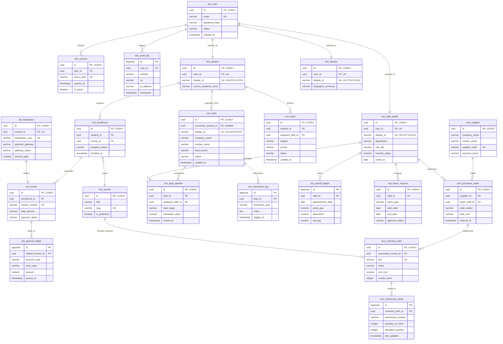

# Database Schema Design Specification

This specification defines the complete database architecture for the HeadStart digital ecosystem. It establishes the conceptual models, logical entities, table prefix structures, relationships and data types required across all implementation phases. The system is designed to run on a unified PostgreSQL 16 cluster, using explicit table prefixing to balance logical phase separation with relational cross-joining capabilities.

## 1. Conceptual Database Design

At a conceptual level, the HeadStart ecosystem maps out distinct enterprise domains that scale systematically across lifecycle phases. This model bridges identity control, public-facing content management, learning metrics, transactional processing and internal operational reporting.

### 1.1 Core Business Domains

- **Identity & Access Management (Phase 1.1)** : Defines the foundational security boundary. It controls who can access the system, maps role hierarchies and maintains an immutable write-once log of data changes.

- **Content Management System (Phase 1.1)** : Captures public-facing marketing resources, site configuration frames and community lead generation touchpoints.

- **Learning Management System (Phase 2)** : Tracks education paths, logical step-by-step lecture gating, student progress counters and instructor performance metrics.

- **Billing & Finance (Phase 2 & Phase 3)** : Manages local mobile financial services transaction states, automated system invoicing and immutable ledger ledgering.

- **ERP + CRM + SCM Suite (Phase 3)** : Consolidates administrative business lines, including internal payroll metrics, physical asset procurement and sales CRM states.

---

## 2. Entity-Relationship Diagram (ERD)

The following diagram maps the structural linkages, core primary keys, foreign key references and cardinality constraints across the entire domain lifecycle.



---

## 3. Logical Database Design & Schema Layout

The entities below map the physical schemas, data types and structural integrity constraints across the combined enterprise application namespaces.

### 3.1 Identity & Access Management Entities (`iam_*`)

#### Entity : `iam_user`

| Field Name    | Physical Data Type       | Keys / Constraints                        | Operational Purpose                                   |
|---------------|--------------------------|-------------------------------------------|-------------------------------------------------------|
| `id`            | `UUID`                     | Primary Key (*Default* : `uuid_generate_v7()`) | Internal time-ordered unique primary identifier.      |
| `display_id`    | `VARCHAR(32)`              | Unique, Not Null                          | Human-readable user fallback ID (*Example* : `HS-USR-00001`). |
| `email`         | `VARCHAR(255)`             | Unique, Not Null                          | Account signature used for secure login ingestion.    |
| `password_hash` | `VARCHAR(255)`             | Not Null                                  | Cryptographic signature tracking account secret.      |
| `status`        | `VARCHAR(32)`              | *Check* : `ACTIVE`, `LOCKED`, `SUSPENDED`          | Lifecycle status tracking boundary.                   |
| `created_at`    | `TIMESTAMP WITH TIME ZONE` | *Default* : `CURRENT_TIMESTAMP`                | Metadata baseline logging entry generation.           |

#### Entity : `iam_session`

| Field Name | Physical Data Type       | Keys / Constraints                            | Operational Purpose                                 |
|------------|--------------------------|-----------------------------------------------|-----------------------------------------------------|
| `id`         | `UUID`                     | Primary Key                                   | Session entity token reference mapping.             |
| `user_id`    | `UUID`                     | Foreign Key -> `iam_user(id)` ON DELETE CASCADE | Relational link mapping to the authenticating user. |
| `token_hash` | `VARCHAR(64)`              | Not Null                                      | SHA-256 token verification hash.                    |
| `expires_at` | `TIMESTAMP WITH TIME ZONE` | Not Null                                      | Hard lifetime boundary enforcing login validity.    |
| `is_active`  | `BOOLEAN`                  | *Default* : `TRUE`                                 | State flag allowing rapid manual revocation.        |

#### Entity : `iam_audit_log`

| Field Name | Physical Data Type       | Keys / Constraints                             | Operational Purpose                                      |
|------------|--------------------------|------------------------------------------------|----------------------------------------------------------|
| `id`         | `BIGSERIAL`                | Primary Key                                    | Monotonically increasing record ID.                      |
| `user_id`    | `UUID`                     | Foreign Key -> `iam_user(id)` ON DELETE SET NULL | Blame-assignment baseline track tracking entity changes. |
| `method`     | `VARCHAR(8)`               | Not Null (*Example* : `POST`, `DELETE`)                  | HTTP payload manipulation verb representation.           |
| `uri`        | `VARCHAR(255)`             | Not Null                                       | Target route mapping modified parameters.                |
| `ip_address` | `VARCHAR(45)`              | Not Null                                       | Ingress network path validation (IPv4 / IPv6 support).     |
| `timestamp`  | `TIMESTAMP WITH TIME ZONE` | *Default* : `CURRENT_TIMESTAMP`                     | Temporal ledger point tracking when actions occurred.    |

### 3.2 Learning Management System Entities (`lms_*`)

#### Entity : `lms_student`

| Field Name             | Physical Data Type | Keys / Constraints                                    | Operational Purpose                                                                 |
|------------------------|--------------------|-------------------------------------------------------|-------------------------------------------------------------------------------------|
| `id`                     | `UUID`               | Primary Key (*Default* : `uuid_generate_v7()`)             | Internal primary academic identity identifier.                                      |
| `user_id`                | `UUID`               | Foreign Key -> `iam_user(id)` ON DELETE PROTECT, UNIQUE | Resolves student authorization records securely.                                    |
| `display_id`             | `VARCHAR(32)`        | Unique, Not Null                                      | Human-readable identifier matching string code conventions (*Example* : `HS-STD-00042`). |
| `current_academic_level` | `VARCHAR(64)`        | Not Null                                              | Structural curriculum segmentation tracker (*Example* : `Skills`, `Professional`).            |

#### Entity : `lms_teacher`

| Field Name         | Physical Data Type | Keys / Constraints                                    | Operational Purpose                                                                 |
|--------------------|--------------------|-------------------------------------------------------|-------------------------------------------------------------------------------------|
| `id`                 | `UUID`               | Primary Key (*Default* : `uuid_generate_v7()`)             | Internal primary educator record key tracking.                                      |
| `user_id`            | `UUID`               | Foreign Key -> `iam_user(id)` ON DELETE PROTECT, UNIQUE | Resolves faculty authorization records securely.                                    |
| `display_id`         | `VARCHAR(32)`        | Unique, Not Null                                      | Human-readable identifier matching string code conventions (*Example* : `HS-TCH-02045`). |
| `biographic_summary` | `TEXT`               | Nullable                                              | Content summary containing public biographical information.                                |

#### Entity : `lms_course`

| Field Name   | Physical Data Type | Keys / Constraints | Operational Purpose                                       |
|--------------|--------------------|--------------------|-----------------------------------------------------------|
| `id`           | `UUID`               | Primary Key        | Course instance identification string.                    |
| `title`        | `VARCHAR(255)`       | Not Null           | Human-readable course metadata descriptor.                |
| `slug`         | `VARCHAR(255)`       | Unique, Not Null   | Clean URL path tracking parameter for NextJS views.      |
| `is_published` | `BOOLEAN`            | *Default* : `FALSE`     | Toggle flag managing public catalog ingestion visibility. |

#### Entity : `lms_enrollment`

| Field Name      | Physical Data Type       | Keys / Constraints                              | Operational Purpose                                      |
|-----------------|--------------------------|-------------------------------------------------|----------------------------------------------------------|
| `id`              | `UUID`                     | Primary Key                                     | Transaction ledger record logging user access approvals. |
| `student_id`         | `UUID`                     | Foreign Key -> `lms_student(id)` ON DELETE PROTECT   | Maps course access authorization layers to specific student accounts.         |
| `course_id`       | `UUID`                     | Foreign Key -> `lms_course(id)` ON DELETE PROTECT | Maps access permissions to a core academic resource.     |
| `progress_status` | `VARCHAR(32)`              | *Check* : `IN_PROGRESS`, `COMPLETED`                   | Tracks structural course completion constraints.         |
| `enrolled_at`     | `TIMESTAMP WITH TIME ZONE` | *Default* : `CURRENT_TIMESTAMP`                      | Temporal tracking baseline logging initial checkout.     |

### 3.3 Customer Relationship Management Entities (`crm_*`)

#### Entity : `crm_lead`

| Field Name        | Physical Data Type       | Keys / Constraints                             | Operational Purpose                                                    |
|-------------------|--------------------------|------------------------------------------------|------------------------------------------------------------------------|
| `id`                | `UUID`                     | Primary Key (*Default* : `uuid_generate_v7()`)      | Internal primary tracking identifier.                                  |
| `display_id`        | `VARCHAR(32)`              | Unique, Not Null                               | Public-facing ID string (*Example* : `HS-LED-10042`) used in public APIs / URLs. |
| `converted_student_id` | `UUID`                     | Foreign Key -> `lms_student(id)` ON DELETE SET NULL | Link establishing academic account profile creation post-sale.                          |
| `company_name`      | `VARCHAR(255)`             | Nullable                                       | Organization tracking attribute for B2B / Corporate client segments.     |
| `contact_name`      | `VARCHAR(255)`             | Not Null                                       | Core contact tracking target attribute.                                |
| `lead_source`       | `VARCHAR(64)`              | *Default* : `WEB_INBOUND`                           | Attribution identifier tracking marketing ROI vectors.                 |
| `status`            | `VARCHAR(32)`              | *Check* : `NEW`, `QUALIFIED`, `LOST`, `CONVERTED`         | Pipeline status marker tracking deal state progression.                |
| `created_at`        | `TIMESTAMP WITH TIME ZONE` | *Default* : `CURRENT_TIMESTAMP`                     | Audit log marker tracking pipeline ingress.                            |

#### Entity : `crm_deal_pipeline`

| Field Name        | Physical Data Type       | Keys / Constraints                                      | Operational Purpose                                   |
|-------------------|--------------------------|---------------------------------------------------------|-------------------------------------------------------|
| `id`                | `UUID`                     | Primary Key                                             | Tracks individual sales transactions.                 |
| `lead_id`           | `UUID`                     | Foreign Key -> `crm_lead(id)` ON DELETE CASCADE           | Explicit mapping to source contact profile.           |
| `assigned_staff_id` | `UUID`                     | Foreign Key -> `erp_staff_profile(id)` ON DELETE SET NULL | Sales executive responsible for closing transactions. |
| `deal_stage`        | `VARCHAR(64)`              | Not Null                                                | Pipeline mapping state tracking ongoing negotiations. |
| `estimated_value`   | `NUMERIC(12, 2)`           | Not Null                                                | Projected transaction volume metric.                  |
| `closed_at`         | `TIMESTAMP WITH TIME ZONE` | Nullable                                                | Resolution time tracking parameter.                   |

#### Entity : `crm_interaction_log`

| Field Name       | Physical Data Type       | Keys / Constraints                            | Operational Purpose                                            |
|------------------|--------------------------|-----------------------------------------------|----------------------------------------------------------------|
| `id`               | `BIGSERIAL`                | Primary Key                                   | System index row tracker.                                      |
| `lead_id`          | `UUID`                     | Foreign Key -> `crm_lead(id)` ON DELETE CASCADE | Mapping pointer anchoring log details to targeted leads.       |
| `interaction_type` | `VARCHAR(32)`              | *Check* : `EMAIL`, `CALL`, `MEETING`                   | Channel categorization marker.                                 |
| `notes`            | `TEXT`                     | Not Null                                      | Qualitative history tracking detailing conversation summaries. |
| `logged_at`        | `TIMESTAMP WITH TIME ZONE` | *Default* : `CURRENT_TIMESTAMP`                    | Explicit timeline point anchoring historical activity logs.    |

#### Entity : `crm_ticket`

| Field Name        | Physical Data Type       | Keys / Constraints                                      | Operational Purpose                                      |
|-------------------|--------------------------|---------------------------------------------------------|----------------------------------------------------------|
| `id`                | `UUID`                     | Primary Key                                             | Post-purchase customer help desk issue tracking item.    |
| `student_id`           | `UUID`                     | Foreign Key -> `lms_student(id)` ON DELETE PROTECT           | The specific student profile raising operational error flags.    |
| `assigned_staff_id` | `UUID`                     | Foreign Key -> `erp_staff_profile(id)` ON DELETE SET NULL | System agent handling ticket diagnostics and mitigation. |
| `subject`           | `VARCHAR(255)`             | Not Null                                                | Summary heading tracking issue nature.                   |
| `priority`          | `VARCHAR(16)`              | *Check* : `LOW`, `MEDIUM`, `HIGH`, `CRITICAL`                      | SLA routing rule prioritization index.                   |
| `status`            | `VARCHAR(32)`              | *Check* : `OPEN`, `RESOLVED`, `CLOSED`                           | Issue state tracker.                                     |
| `created_at`        | `TIMESTAMP WITH TIME ZONE` | *Default* : `CURRENT_TIMESTAMP`                              | Operational performance tracking start time.             |

### 3.4 Enterprise Resource Planning Entities (`erp_*`)

#### Entity : `erp_staff_profile`

| Field Name     | Physical Data Type | Keys / Constraints                                    | Operational Purpose                                                |
|----------------|--------------------|-------------------------------------------------------|--------------------------------------------------------------------|
| `id`             | `UUID`               | Primary Key (*Default* : `uuid_generate_v7()`)             | Corporate internal primary key identification.                     |
| `display_id`     | `VARCHAR(32)`        | Unique, Not Null                                      | Human-readable public identifier with prefix (*Example* : `HS-STF-29651`). |
| `user_id`        | `UUID`               | Foreign Key -> `iam_user(id)` ON DELETE PROTECT, UNIQUE | High-integrity link connecting employees to credentials.           |
| `department`     | `VARCHAR(64)`        | Not Null                                              | Allocation silo mapping internal cost centers.                     |
| `role_title`     | `VARCHAR(64)`        | Not Null                                              | Corporate designation descriptor.                                  |
| `monthly_salary` | `NUMERIC(12, 2)`     | Not Null                                              | Financial base rate processing parameter.                          |
| `joined_at`      | `DATE`               | Not Null                                              | Corporate timeline metric tracking retention states.               |

#### Entity : `erp_payroll_ledger`

| Field Name        | Physical Data Type | Keys / Constraints                                     | Operational Purpose                                                    |
|-------------------|--------------------|--------------------------------------------------------|------------------------------------------------------------------------|
| `id`                | `BIGSERIAL`          | Primary Key                                            | Row sequence tracking entity.                                          |
| `staff_id`          | `UUID`               | Foreign Key -> `erp_staff_profile(id)` ON DELETE PROTECT | Target employee recipient reference map.                               |
| `disbursement_date` | `DATE`               | Not Null                                               | Explicit financial processing calendar day logging settlement.         |
| `gross_pay`         | `NUMERIC(12, 2)`     | Not Null                                               | Pre-tax basic rate allocation sum.                                     |
| `deductions`        | `NUMERIC(12, 2)`     | *Default* : `0.00`                                          | Financial baseline calculating performance penalties or tax withholds. |
| `net_pay`           | `NUMERIC(12, 2)`     | Not Null                                               | Actual cash sum dispersed out of business resources.                   |

#### Entity : `erp_leave_request`

| Field Name      | Physical Data Type | Keys / Constraints                                     | Operational Purpose                                                  |
|-----------------|--------------------|--------------------------------------------------------|----------------------------------------------------------------------|
| `id`              | `UUID`               | Primary Key                                            | Track internal operational resource planning schedules.              |
| `staff_id`        | `UUID`               | Foreign Key -> `erp_staff_profile(id)` ON DELETE CASCADE | Requesting structural staff profile identification tag.              |
| `leave_type`      | `VARCHAR(32)`        | *Check* : `SICK`, `CASUAL`, `MATERNITY`                         | System validation categorization track.                              |
| `start_date`      | `DATE`               | Not Null                                               | Initial out-of-office performance baseline date tracking constraint. |
| `end_date`        | `DATE`               | Not Null                                               | Return schedule target check parameter.                              |
| `approval_status` | `VARCHAR(32)`        | *Check* : `PENDING`, `APPROVED`, `REJECTED`                     | Operational tracking signature state.                                |

#### Entity : `erp_general_ledger`

| Field Name         | Physical Data Type       | Keys / Constraints                                | Operational Purpose                                               |
|--------------------|--------------------------|---------------------------------------------------|-------------------------------------------------------------------|
| `id`                 | `BIGSERIAL`                | Primary Key                                       | Master sequence index for double-entry financial compliance logs. |
| `related_invoice_id` | `UUID`                     | Foreign Key -> `bil_invoice(id)` ON DELETE SET NULL | Dynamic data pipe mapping billing changes to accounting journals. |
| `account_code`       | `VARCHAR(32)`              | Not Null                                          | Corporate chart of accounts classification tracking parameters.   |
| `entry_type`         | `VARCHAR(8)`               | *Check* : `DEBIT`, `CREDIT`                              | Structural double-entry system data orientation indicator.        |
| `amount`             | `NUMERIC(12, 2)`           | Not Null                                          | Hard financial value tracking parameter.                          |
| `posted_at`          | `TIMESTAMP WITH TIME ZONE` | *Default* : `CURRENT_TIMESTAMP`                        | High-integrity compliance checkpoint recording post processing.   |

### 3.5 Supply Chain Management Entities (`scm_*`)

#### Entity : `scm_supplier`

| Field Name    | Physical Data Type | Keys / Constraints | Operational Purpose                                          |
|---------------|--------------------|--------------------|--------------------------------------------------------------|
| `id`            | `UUID`               | Primary Key        | Vendor enterprise key mapping framework.                     |
| `company_name`  | `VARCHAR(255)`       | Not Null           | External organization identifier parameter.                  |
| `contact_email` | `VARCHAR(255)`       | Not Null           | Communication delivery endpoint for purchasing integrations. |
| `supplier_code` | `VARCHAR(64)`        | Unique, Not Null   | Alpha-numeric tracking constant (*Example* : `SUPP-BK-01`).          |
| `payment_terms` | `VARCHAR(64)`        | *Default* : `NET_30`    | Explicit processing legal bounds configuration mapping.      |

#### Entity : `scm_purchase_order`

| Field Name     | Physical Data Type       | Keys / Constraints                                     | Operational Purpose                                             |
|----------------|--------------------------|--------------------------------------------------------|-----------------------------------------------------------------|
| `id`             | `UUID`                     | Primary Key                                            | Procurement flow track logging incoming vendor bills.           |
| `supplier_id`    | `UUID`                     | Foreign Key -> `scm_supplier(id)` ON DELETE PROTECT      | Vendor tracking element pointing to structural source entity.   |
| `buyer_staff_id` | `UUID`                     | Foreign Key -> `erp_staff_profile(id)` ON DELETE PROTECT | Internal corporate worker auditing asset authorization metrics. |
| `order_status`   | `VARCHAR(32)`              | *Check* : `DRAFT`, `ORDERED`, `RECEIVED`, `CANCELLED`             | Procurement lifecycle tracker state configuration.              |
| `total_cost`     | `NUMERIC(12, 2)`           | Not Null                                               | Accumulator metric tracking purchasing spending allocations.    |
| `ordered_at`     | `TIMESTAMP WITH TIME ZONE` | *Default* : `CURRENT_TIMESTAMP`                             | Initial baseline logging outbound asset orders.                 |

#### Entity : `scm_inventory_item`

| Field Name           | Physical Data Type | Keys / Constraints                               | Operational Purpose                                                           |
|----------------------|--------------------|--------------------------------------------------|-------------------------------------------------------------------------------|
| `id`                   | `UUID`               | Primary Key                                      | Product configuration management master tracking index row.                   |
| `associated_course_id` | `UUID`               | Foreign Key -> `lms_course(id)` ON DELETE SET NULL | Connects physical inventory elements (*Example* : `textbook kit`) to digital courses. |
| `sku`                  | `VARCHAR(100)`       | Unique, Not Null                                 | Stock Keeping Unit (SKU) managing physical stock identification routines.           |
| `name`                 | `VARCHAR(255)`       | Not Null                                         | Human-readable name descriptor.                                               |
| `unit_cost`            | `NUMERIC(12, 2)`     | Not Null                                         | SCM inventory valuation asset indexing matrix element.                        |
| `reorder_level`        | `INTEGER`            | *Default* : `10`                                      | Safety threshold marker triggering automated stock replenishment pipelines.   |

#### Entity : `scm_warehouse_stock`

| Field Name         | Physical Data Type       | Keys / Constraints                                      | Operational Purpose                                                   |
|--------------------|--------------------------|---------------------------------------------------------|-----------------------------------------------------------------------|
| `id`                 | `BIGSERIAL`                | Primary Key                                             | Stock location tracker table sequence ID.                             |
| `inventory_item_id`  | `UUID`                     | Foreign Key -> `scm_inventory_item(id)` ON DELETE CASCADE | Link anchoring volumetric balance logs to actual specific SKUs.       |
| `warehouse_location` | `VARCHAR(128)`             | Not Null                                                | Target physical building space descriptor parsing layout maps.        |
| `quantity_on_hand`   | `INTEGER`                  | *Check* : `quantity_on_hand >= 0`                            | Hard structural baseline mapping current physical item counts.        |
| `allocated_quantity` | `INTEGER`                  | *Check* : `allocated_quantity <= quantity_on_hand`           | Inventory allocations holding ordered stocks away from sales funnels. |
| `last_updated`       | `TIMESTAMP WITH TIME ZONE` | *Default* : `CURRENT_TIMESTAMP`                              | Delta mapping update tracker timeline log row.                        |

### 3.6 Billing & Financials Entities (`bil_*`)

#### Entity : `bil_invoice`

| Field Name     | Physical Data Type | Keys / Constraints                                 | Operational Purpose                                                  |
|----------------|--------------------|----------------------------------------------------|----------------------------------------------------------------------|
| `id`             | `UUID`               | Primary Key                                        | Master invoicing target ledger.                                      |
| `enrollment_id`   | `UUID`               | Foreign Key -> `lms_enrollment(id)` ON DELETE PROTECT | Link attaching a bill document to an absolute course access request. |
| `invoice_number` | `VARCHAR(64)`        | Unique, Not Null                                   | Tracking key configuration structure matching regulatory parameters. |
| `total_amount`   | `NUMERIC(12, 2)`     | Not Null                                           | Complete cash balance value requested for payment processing.        |
| `payment_status` | `VARCHAR(32)`        | *Check* : `UNPAID`, `PAID`, `REFUNDED`                      | Transaction state manager flag configuration tracking points.        |

#### Entity : `bil_transaction`

| Field Name       | Physical Data Type | Keys / Constraints                                       | Operational Purpose                                                                 |
|------------------|--------------------|----------------------------------------------------------|-------------------------------------------------------------------------------------|
| `id`               | `UUID`               | Primary Key                                              | Low-level transaction ledger archiving explicit processing steps.                   |
| `invoice_id`       | `UUID`               | Foreign Key -> `bil_invoice(id)` ON DELETE PROTECT, UNIQUE | High-integrity link connecting exact single bills to payment results.               |
| `transaction_uuid` | `VARCHAR(255)`       | Unique, Not Null                                         | Unique transactional identifier string extracted out of gateway webhook signatures. |
| `payment_gateway`  | `VARCHAR(64)`        | *Check* : `BKASH`, `SSLCOMMERZ`                                 | Vector source route naming flag categorization mapping.                             |
| `gateway_status`   | `VARCHAR(64)`        | Not Null                                                 | Logging string tracking raw callback states during debugging routines.              |
| `amount_paid`      | `NUMERIC(12, 2)`     | Not Null                                                 | Absolute volume processed out of public networks to verify matches.                 |

---

## 4. PostgreSQL Performance & Optimization Indexes

Because public-facing APIs, customer support lookups and administrative UIs route queries through the human-readable `display_id` columns, we must introduce unique index constraints on these fields to maintain sub-millisecond query execution.

```sql
-- ====================================================================
-- PUBLIC-FACING DISPLAY ID LOOKUP OPTIMIZATIONS
-- ====================================================================
-- Ensures lightning-fast profile routing when users / staff fetch data via external strings

CREATE UNIQUE INDEX idx_iam_user_display 
ON iam_user (display_id);

CREATE UNIQUE INDEX idx_lms_student_display 
ON lms_student (display_id);

CREATE UNIQUE INDEX idx_lms_teacher_display 
ON lms_teacher (display_id);

CREATE UNIQUE INDEX idx_crm_lead_display 
ON crm_lead (display_id);

CREATE UNIQUE INDEX idx_erp_staff_display 
ON erp_staff_profile (display_id);
```

---

## 5. Global Database Security & Integrity Constraints

### 5.1 Fixed-Precision Numeric Enforcement (Anti-Rounding Fault Rules)

Floating-point parameters (`FLOAT`, `DOUBLE` `PRECISION`) are **strictly prohibited** anywhere across the application schema for calculating value transformations.

- All currency instances, financial values, wage tables, tax pools, and transaction volumes map exclusively to the `NUMERIC(12, 2)` data type structure.

- This constraint provides exact decimal tracking up to `9,999,999,999.99` without rounding drift bugs, meeting international financial compliance and audit guidelines.

### 5.2 Cascade and Delete Execution Protections (Referential Sandboxing)

To safeguard operational integrity and protect historical business intelligence fields, explicit cascade configuration limits are applied to database tables : 

- **`ON DELETE PROTECT`** : Enforced across vital financial interfaces, including `bil_invoice`, `bil_transaction`, `erp_payroll_ledger` and `scm_purchase_order`. A user account profile or system record cannot be dropped if it contains nested transactions downstream in a payment journal. No changes to table names here, but ensure any application reference filters watch `lms_enrollment` records.

- **`ON DELETE CASCADE`** : Limited exclusively to transient or non-critical tracking entities, such as `iam_session`, `crm_interaction_log` and `scm_warehouse_stock`. This approach isolates mass deletion cascades safely within logical sandboxes.

### 5.3 Automated Real-Time System Integrity Invariants

Database-level constraints are defined to protect internal operations against invalid states, ensuring data validation occurs directly within the engine loopback : 

- **Inventory Balance Constraint** : `scm_warehouse_stock` uses check constraints to enforce `quantity_on_hand >= 0`. This stops inventory values from dropping below zero during concurrent transactional anomalies.

- **Allocation Cap Constraint** : `scm_warehouse_stock` uses check constraints to enforce `allocated_quantity <= quantity_on_hand`. This prevents over-allocating stock items that are not physically present in the warehouse layout.

- **Date Bounds Consistency Check** : `erp_leave_request` uses a validation check constraint to enforce `end_date >= start_date`, catching chronological errors before they pollute administrative planning calendars.

### 5.4 External Display ID Validation Rules

To eliminate structural format creep across human-readable identifiers, the database engine enforces strict alphanumeric formatting checks on all `display_id` allocations before committing the data row : 

- **Role-Based Prefix Integrity** : Check constraints force string verification rules matching the designated entity type : 

```sql
ALTER TABLE lms_student ADD CONSTRAINT chk_student_display_id_format 
CHECK (display_id ~ '^HS-STD-[0-9]{5}$');

ALTER TABLE lms_teacher ADD CONSTRAINT chk_teacher_display_id_format 
CHECK (display_id ~ '^HS-TCH-[0-9]{5}$');

ALTER TABLE erp_staff_profile ADD CONSTRAINT chk_staff_display_id_format 
CHECK (display_id ~ '^HS-STF-[0-9]{5}$');

ALTER TABLE crm_lead ADD CONSTRAINT chk_lead_display_id_format 
CHECK (display_id ~ '^HS-LED-[0-9]{5}$');
```

- **Immutable Isolation Layer** : Security layers require that application query sets isolate the `UUID v7` tokens internally. Public endpoints expose only the `display_id`, eliminating structural vulnerability risks (IDOR / Enumeration) when combined with scoped user access controls.