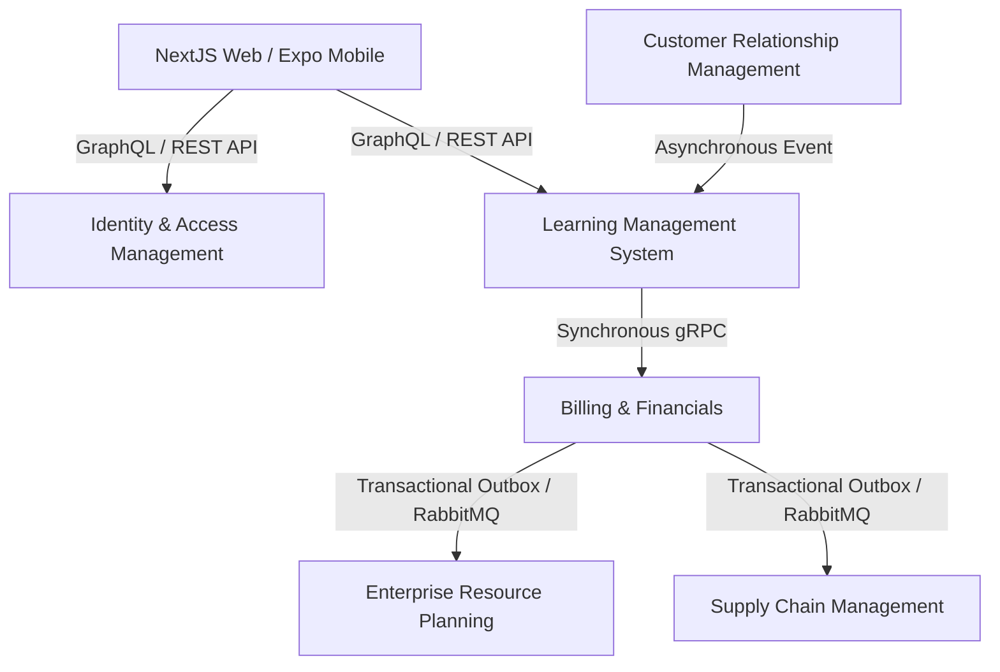
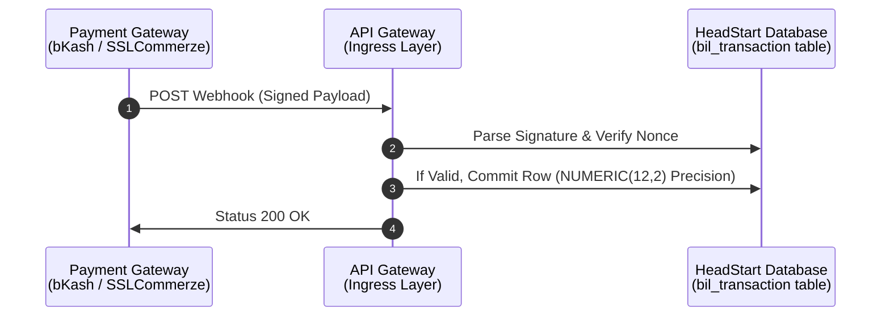

# Integration Scope Identification & Design Specification

This specification establishes the communication contracts, asynchronous messaging structures, third-party hooks and boundary constraints across the HeadStart system landscape. It ensures data consistency and transaction integrity across the isolated database prefixes (`iam_*`, `lms_*`, `crm_*`, `erp_*`, `scm_*`, `bil_*`).

## 1. System Communication Architecture

To balance decoupled application lifecycles with high-integrity data flows, HeadStart utilizes a hybrid communication architecture : 



### 1.1 Synchronous Integration Boundary (`gRPC`)

- **Scope** : High-priority operations requiring instant relational validation, immediate transactional lockouts or low-latency operations.

- **Primary Vectors** : `lms_enrollment` verifying payment status against `bil_invoice` and checking credential token states from `iam_session`.

### 1.2 Asynchronous Integration Boundary (`RabbitMQ Event Bus`)

- **Scope** : Cross-domain actions where processing can fail or complete eventually without impacting user-facing transaction paths.

- **Primary Vectors** : Posting invoice states from `bil_invoice` to `erp_general_ledger` and updating stock balances in `scm_warehouse_stock` when physical inventory kits are bundled with an `lms_course` allocation.

---

## 2. Core Internal Domain Data Pipelines

The system executes cross-schema operations via structured data pipelines utilizing the underlying PostgreSQL engine parameters.

### 2.1 CRM-to-LMS Pipeline : Lead Conversion to Academic Record

- **Trigger** : A `crm_lead` transitions its state to `CONVERTED` via pipeline activity.

- **Data Flow** : 

  - The CRM domain extracts the `id` (UUIDv7) and contact data from the conversion payload.

  - An event triggers the instantiation of an `iam_user` record.

  - The pipeline generates the `lms_student` profile, mapping `user_id` back to the account.

  - The original `crm_lead` record updates its `converted_student_id` foreign key reference to point directly to the new `lms_student(id)`.

- **Payload Contract (JSON)** : 

```json
{
  "event_id": "0190a3c2-4510-7001-a123-bcde456789ab",
  "event_type": "crm.lead.converted",
  "timestamp": "2026-07-06T08:30:00Z",
  "data": {
    "lead_id": "0190a3c2-4510-7001-a123-bcde987654ba",
    "display_id": "HS-LED-10042",
    "contact_name": "Alvi Rahman",
    "email": "alvi@example.com",
    "current_academic_level": "Skills"
  }
}
```

### 2.2 LMS-to-Billing Pipeline : Secure Checkout Enrollment Tracking

- **Trigger** : A student submits a checkout request for a targeted `lms_course`.

- **Data Flow** : 

  - `lms_enrollment` instantiates a transient entry with a `progress_status` of `IN_PROGRESS`.

  - A synchronous request passes transaction totals down to `bil_invoice`, mapping the explicit `enrollment_id`.

  - If the item involves physical assets via `scm_inventory_item`, an inventory reservation lock is dispatched to `scm_warehouse_stock` via the allocation constraint check rules (`allocated_quantity <= quantity_on_hand`).

### 2.3 Billing-to-ERP Pipeline : Financial Ledger Posting

- **Trigger** : A payment webhook changes `bil_invoice.payment_status` to `PAID`.

- **Data Flow** : 

  - The transaction is written to `bil_transaction`, using `NUMERIC(12, 2)` to handle precision balancing without any floating-point drift.

  - An asynchronous worker parses the paid amount and writes double-entry records directly into `erp_general_ledger`.

  - The engine creates balancing row pairs, generating both a `DEBIT` entry against the cash asset account code and a corresponding `CREDIT` entry mapping revenue tracking targets.

---

## 3. 3rd-Party Gateway Integration & Security Boundary

External ingest protocols handling high-liability financial variables route securely through verification layers.



### 3.1 Supported Providers

- **bKash (MFS Gateway)** : Handles immediate personal mobile cash balances.

- **SSLCOMMERZ (Aggregator Gateway)** : Facilitates local Visa, Mastercard and alternative localized internet banking channels.

### 3.2 Security Validation Parameters

- **Webhook Signature Verification** : Every payload processed from external environments requires evaluation against SHA-256 HMAC tokens passed inside client request headers.

- **Replay Attack Defense** : Ingress layers cross-check incoming callback transaction strings against the unique index constraint applied to `bil_transaction(transaction_uuid)` to prevent double-processing.

- **Idempotency Key Rules** : Any status modifications checking or writing downstream accounting markers require persistent ledger states. Transactions are mapped specifically to a strict 1:1 balance row pattern (`invoice_id` foreign key constraint set to `UNIQUE` inside `bil_transaction`).

---

## 4. Integration Verification & Error Mitigations

To protect data consistency when handling asynchronous requests, the system implements resilience mechanisms to handle connectivity drops or timeouts.

### 4.1 Dead Letter Queues (DLQ)

When events fail to process (*Example* : a network failure prevents an invoice from posting to the general ledger), the event bus retries up to 5 times with exponential backoff. If processing still fails, the event is moved to a Dead Letter Queue (`dlq.erp.general_ledger`) for automated administrative alerting and manual inspection.

### 4.2 Two-Phase Transaction Fail-safes

For operations that span multiple schema namespaces, the system utilizes a **Transactional Outbox Pattern** : 

| Step | Database Scope / Namespace | Local Database Transaction State | Action Performed                                                                                            |
|------|----------------------------|----------------------------|-------------------------------------------------------------------------------------------------------------|
| 1    | `bil_*`                      | `BEGIN`                      | Writes payment status into `bil_invoice` and inserts a state record into an internal outbox table.            |
| 2    | `bil_*`                      | `COMMIT`                     | Atomically persists both the invoice state change and the outbox event message.                             |
| 3    | Event Poller Service       | N/A                        | Reads the outbox table and publishes the message to RabbitMQ with a guaranteed at-least-once delivery rule. |
| 4    | `erp_*` / `scm_*`              | `BEGIN` / `COMMIT`             | Consumers receive the event, process local logic and deduplicate using the message's `event_id`.             |

### 4.3 Data Reconciliation Routines

An automated midnight cron job executes cross-prefix validation routines to verify schema consistency : 

- **Inventory Audit** : Confirms that total quantities in `scm_warehouse_stock` match individual item lifecycle footprints across course structures.

- **Financial Audit** : Cross-references total settled entries inside `bil_transaction` with the absolute summation of ledger postings inside `erp_general_ledger` to detect and alert on any financial discrepancies.