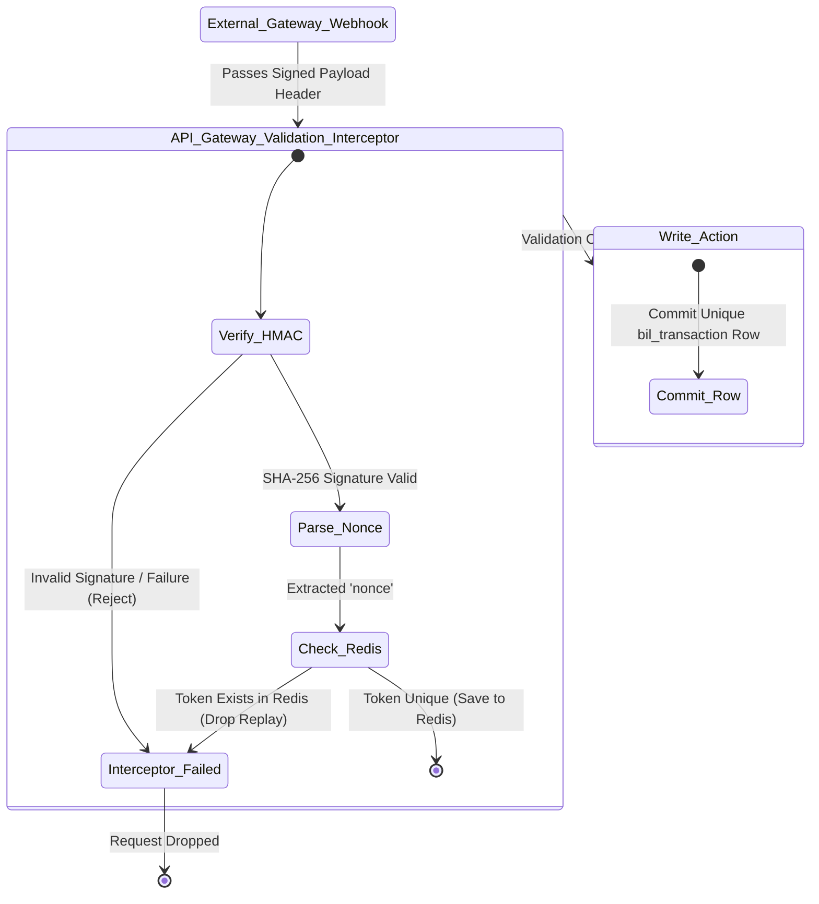

# Security Requirements Specification

This specification defines the absolute security requirements for the HeadStart system landscape. It enforces rigid protection domains across data transit, system identification, authentication persistence and cross-prefix database interactions (`iam_*`, `lms_*`, `crm_*`, `erp_*`, `scm_*`, `bil_*`).

## 1. Authentication, Authorization & Session Hardening (`iam_*`)

### 1.1 Cryptographic Storage Invariants

- **Password Hashing** : System login routes must reject plaintext passwords. Internal secrets mapped to `iam_user.password_hash` must utilize **Argon2id** (profiles configured to minimum parameters : $m=65536$ (64 MB), $t=3$, $p=4$) to prevent side-channel GPU decoding attacks.

- **Token Security** : Token entries inside `iam_session.token_hash` must store a secure, one-way cryptographic hash (**SHA-256**) of the session bearer token rather than storing the token string directly in raw plaintext.

### 1.2 Session Lifecycle Rules

- **Token Structure** : Session tokens generated for clients must utilize **high-entropy cryptographically secure pseudo-random identifiers (CSPRNG)** containing a minimum of 256 bits of entropy.

- **Revocation Dynamics** : Middleware layers must perform rapid database lookups against `iam_session.is_active` on every state change or mutation path. If a session is flagged as `FALSE`, authorization boundaries must immediately isolate the client request, return an HTTP `401 Unauthorized` status and drop nested cache allocations.

- **Hard Expiration** : Any incoming data streams must be cross-checked against `iam_session.expires_at`. Once the timestamp is eclipsed, state tracking systems must automatically lock down routing loops until new credentials are provided.

---

## 2. Ingress Network Protection & Threat Mitigation

### 2.1 TLS Profile & Secure Transit Enforcements

- **Encryption Bounds** : All public routing ingress points must explicitly enforce **TLS 1.3** (with TLS 1.2 as a strict operational baseline boundary). Legacy configurations like TLS 1.0 and TLS 1.1, along with weak cipher suites (*Example* : 3DES, RC4), must be explicitly blocked at the API Gateway level.

- **Transport Security Policies** : Production servers must append a `Strict-Transport-Security` (HSTS) header to all response configurations : 
`max-age=63072000; includeSubDomains; preload`

### 2.2 Rate-Limiting Matrices

To mitigate denial-of-service attempts and systemic enumeration vectors, the API Gateway layer must apply strict request rate boundaries based on ingress path characteristics : 

| Endpoint Target Profile                         | Maximum Request Allowance Window | Time Frame | Breach Mitigation Penalty        |
|-------------------------------------------------|----------------------------------|------------|----------------------------------|
| Public Marketing Catalog / Inbound Assets       | 100 requests                     | 60 seconds | HTTP 429 Too Many Requests       |
| Core LMS Activity / Interactive API Views       | 60 requests                      | 60 seconds | HTTP 429 Too Many Requests       |
| Identity Manipulation Paths (`/api/v1/auth/*`)    | 5 requests                       | 60 seconds | IP Block + Account Lock Tracking |
| Third-Party Webhook Endpoints (`/api/v1/hooks/*`) | 200 requests                     | 60 seconds | Immediate IP Sandboxing          |

---

## 3. Data Protection, Isolation & Anti-Enumeration (IDOR)

### 3.1 Immutable External Identifier Abstraction Layer

To systematically eliminate **Insecure Direct Object Reference (IDOR)** vulnerability vectors, the public surface landscape is decoupled from internal physical database keys : 

- **Internal Sequence Obscurity** : Sequential database row IDs, bigserial indicators and real `UUIDv7` tokens must never be exposed outside the network perimeter via client APIs, web components, form actions or URL routing paths.

- **Public Routing Requirements** : Frontend routing controllers inside the NextJS and Expo mobile application architectures must navigate resource domains exclusively using public-facing display parameters (*Example* : `display_id` for profile views, `slug` for course indexing).

### 3.2 Display ID Regex Validation Anchors

The database layer acts as the final line of defense against format validation creep. Database engines must explicitly implement `ALTER TABLE ... ADD CONSTRAINT` checks to prevent malformed injections from polluting underlying data sets : 

```sql
-- Enforced pattern syntax validation checks within the Postgres transaction loop
ALTER TABLE lms_student ADD CONSTRAINT chk_student_display_id_format CHECK (display_id ~ '^HS-STD-[0-9]{5}$');
ALTER TABLE lms_teacher ADD CONSTRAINT chk_teacher_display_id_format CHECK (display_id ~ '^HS-TCH-[0-9]{5}$');
ALTER TABLE erp_staff_profile ADD CONSTRAINT chk_staff_display_id_format CHECK (display_id ~ '^HS-STF-[0-9]{5}$');
ALTER TABLE crm_lead ADD CONSTRAINT chk_lead_display_id_format CHECK (display_id ~ '^HS-LED-[0-9]{5}$');
```

---

## 4. 3rd-Party Perimeter Verification Bounds (`bil_*`)

Data paths communicating with external financial vectors (*Example* : bKash and SSLCOMMERZ) must validate authenticity parameters before execution permissions are granted.



### 4.1 Request Validation Security Rules

- **Signature Attestation** : Callback handlers processing state triggers across payment pipelines must extract the webhook payload body signature and verify it using a **SHA-256 HMAC key-hashed message authentication code** securely loaded from cloud signature vaults at runtime.

- **Deduplication & Replay Defense** : Ingress layers must extract transaction trackers and pass them through a deduplication filtering system before initiating database mutation routines. Any incoming transaction string must hit the unique index constraint applied to `bil_transaction(transaction_uuid)` to guarantee that execution loops do not run multiple times for the same transaction.

---

## 5. Administrative Auditing & Compliance Control Logging

### 5.1 Immutable Audit Trail Enforcements

- **Traceability Mapping** : System actions that introduce writes, deletes, updates or permission modifications must automatically commit contextual markers to `iam_audit_log`.

- **Metadata Scope Requirements** : Every auditing data block written to the transaction sequence must track explicit forensic indicators : 

```json
{
  "audit_record_id": 984512034,
  "user_id": "0190a3c2-4510-7001-a123-bcde456789ab",
  "http_method": "DELETE",
  "request_uri": "/api/v1/erp/payroll_ledger/1042",
  "ip_address": "192.168.10.45",
  "timestamp_tz": "2026-07-07T06:39:35Z"
}
```

- **Log Preservation Invariant** : The database structural constraint rules mapped to `iam_audit_log` entities must apply `ON DELETE SET NULL` on `user_id` adjustments to ensure the underlying transaction ledger records are never removed or destroyed during maintenance cycles.