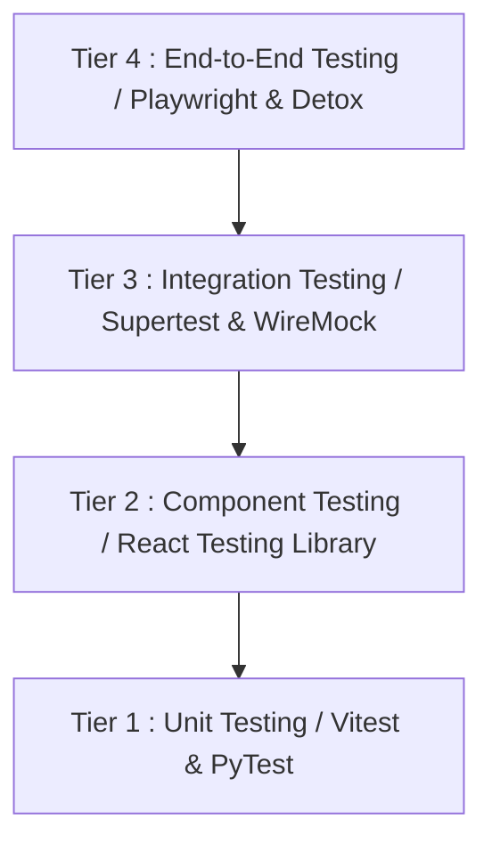
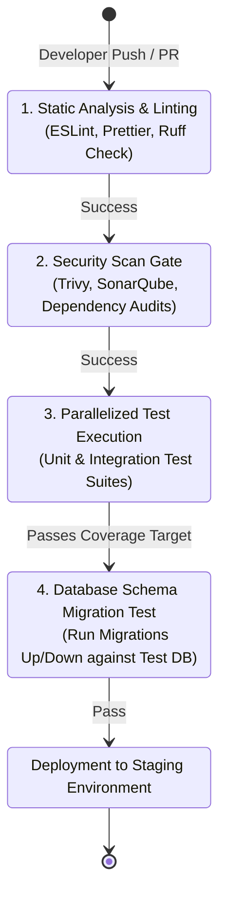

# Quality Assurance (QA) Management Specification

This specification defines the quality assurance framework, testing strategy, automation metrics and verification gates for the HeadStart digital ecosystem. It guarantees that applications across NextJS and Expo mobile architectures meet strict functional, performance and transactional integrity invariants directly mapped to core database schemas (`iam_*`, `lms_*`, `crm_*`, `erp_*`, `scm_*`, `bil_*`).

## 1. Multi-Tier Testing Strategy

To ensure comprehensive coverage and systemic reliability across decoupled modules, HeadStart implements a four-tiered testing pyramid : 



### 1.1 Tier 1 : Unit Testing

- **Scope** : Isolated pure functions, validation helpers, utility modules and domain logic hooks.

- **Tooling** : `Vitest` (NextJS Web / Expo Mobile) and `PyTest` (Python / Django Services).

- **Target KPI** : 100% code coverage on core cryptographic hashing modules (*Example* : Argon2id parameters) and data formatting utils.

### 1.2 Tier 2 : Component Testing

- **Scope** : Isolated UI components, layout frames, custom form inputs and interactive states.

- **Tooling** : `React Testing Library` / `React Native Testing Library`.

- **Target KPI** : Verification of error states, form input patterns and regex enforcement mock behaviors for human-readable identifiers.

### 1.3 Tier 3 : Integration Testing

- **Scope** : Communication boundaries between services, API route handlers and database operations within local transactions.

- **Tooling** : `Supertest`, `WireMock` for external payment gateways and a dedicated Dockerized PostgreSQL instance.

- **Target KPI** : 100% accuracy of double-entry matching inside `erp_general_ledger` and 1:1 unique constraints on `bil_transaction` maps during webhook ingestion.

### 1.4 Tier 4 : End-to-End (E2E) Testing

- **Scope** : Real-world user journeys executing fully integrated flows through the UI down to database updates.

- **Tooling** : `Playwright` (Web Browser Testing) and `Detox` (React Native / Expo Mobile Device Emulation).

- **Target KPI** : Validation of high-liability critical business lines, such as the complete path from a `crm_lead` changing to `CONVERTED` to the instantiation of an active academic student profile.

---

## 2. Test Execution & Automation Metrics

A test suite is only as effective as the boundaries it enforces. HeadStart adheres to strict target metrics that serve as blocking gates within automated workflows.

### 2.1 Coverage Invariants

| Testing Layer     | Code Coverage Target | Enforcement Scope                                       | Blocking Action             |
|-------------------|----------------------|---------------------------------------------------------|-----------------------------|
| Unit Tests        | $\ge 90\%$           | System-wide utility and core application modules        | Prevents Pull Request Merge |
| Integration Tests | $\ge 80\%$           | Cross-prefix route controllers and service pipelines    | Blocks Deployments          |
| Security Audits   | 100% Compliance      | Static Analysis (SAST) & Dependency Vulnerability Scans | Disables CI Build Pipeline  |

### 2.2 Performance & Load-Testing Benchmarks

Automated performance profiling utilizes `k6` to simulate user load behavior against API gateways. Test suites execute scripts simulating real-world scenarios : 

- **Baseline Performance** : Under normal operating volume (1,000 concurrent virtual users), 95% of standard API views must achieve a latency footprint of $t \le 200\text{ms}$.

- **High-Priority Operations** : High-frequency endpoints—including token validations via `iam_session` — must maintain an ultra-low latency response curve where $p99 \le 50\text{ms}$.

- **Stress Boundaries** : Webhook ingest paths processing external payment notifications must process payloads at a sustained rate of 200 requests/second without throwing errors or introducing precision drift bugs into numeric fields.

---

## 3. Database Integrity & Validation Testing

Because HeadStart uses specific structural database layouts and constraint policies, the QA suite includes automated integration suites dedicated to checking data-layer invariants.

```sql
-- QA Test Scenario : Attempting malformed identifier injection
-- Intended Result : DB engine throws a Check Constraint Violation
BEGIN;
INSERT INTO lms_student (id, display_id, current_academic_level, user_id) 
VALUES (
    '0190a3c2-4510-7001-a123-bcde456789ab', 
    'INVALID-PREFIX-001', -- malformed string format
    'Skills', 
    '0190a3c2-4510-7001-a123-bcde987654ba'
);
-- Test asserts that an explicit exception is captured here
ROLLBACK;
```

### 3.1 Structural Invariant Verification Suites

- **Anti-Rounding Tests** : Automation vectors insert fractionally drifting transactional amounts into invoice entities. The test case asserts that any conversion attempts that deviate from the `NUMERIC(12, 2)` standard are immediately rejected or securely clamped according to fixed-precision financial requirements.

- **Constraint Triggers** : Integration tests attempt to force negative numbers into `quantity_on_hand` fields inside `scm_warehouse_stock` to verify that transactional database loops trigger an absolute check constraint failure.

- **Display ID Regex Scans** : Test scripts inject invalid alphanumeric codes into fields mapped to public profiles to verify that format restrictions consistently block inputs that violate pattern definitions.

---

## 4. Continuous Integration & Deployment (CI / CD) QA Gates

To eliminate code drift and prevent regressions in production environments, the quality suite acts as a mandatory validation gate inside the GitHub automation pipeline.



### 4.1 Automated Validation Checkpoints

- **Static Analysis & Style Bounds** : Automated linting checks execute (`ESLint` for TypeScript environments, `Ruff` for Python engines) on code push. Any styling format deviations or unhandled type definitions halt processing.

- **Security Scans** : Automated security scanners run static code analysis (SAST) checks to scan for exposed keys, verify encryption rules (such as Argon2id setups), and check for insecure dependencies.

- **Parallel Execution** : Unit and integration test suites run concurrently across isolated environments to minimize pipeline execution time.

- **Migration Resilience** : Schema updates apply directly to an ephemeral, isolated database instance. The runner attempts an upstream migration followed by a complete rollback cycle to confirm schema scripts are fully reversible.

---

## 5. User Acceptance Testing (UAT) & Production Defect Protocols

### 5.1 UAT Ingress Strategy

- **Staging Environment Mirroring** : Acceptance procedures take place inside a staging environment that mirrors the architecture of production clusters, using sanitized data sets to protect real-user privacy.

- **Sign-Off Boundaries** : Core application releases require explicit validation signs across automated test suites, engineering product owners and security compliance leads.

### 5.2 Post-Deployment Defect Classification Matrix

When errors slip through automated QA checks and manifest within production systems, they are cataloged and triaged based on severity : 

| Severity Level | Structural Definition                                                                                | Target SLA Resolution Window | Remediation Protocol                                                                  |
|----------------|------------------------------------------------------------------------------------------------------|------------------------------|---------------------------------------------------------------------------------------|
| **P1 : Critical**   | System-wide downtime, security compromises or financial anomalies (*Example* : balance precision errors). | $\le 2\text{ hours}$                                                                          | Immediate code freeze; hotfix dispatch or immediate infrastructure rollback. |
| **P2 : Major**      | Essential domain modules failing (*Example* : student enrollment blocks) with no viable workaround.        | $\le 8\text{ hours}$         | Dedicated engineering patch sprint; deployment within standard daily pipeline window. |
| **P3 : Minor**      | Cosmetic adjustments, small interface misalignments or non-blocking operational inconveniences.     | Next regular sprint release  | Add to product backlog for routine prioritization and standard release grouping.      |