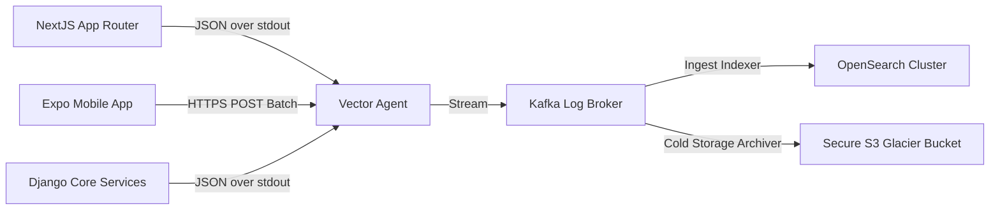
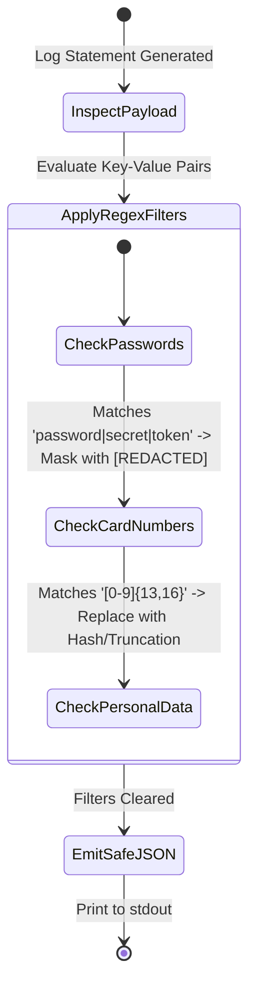
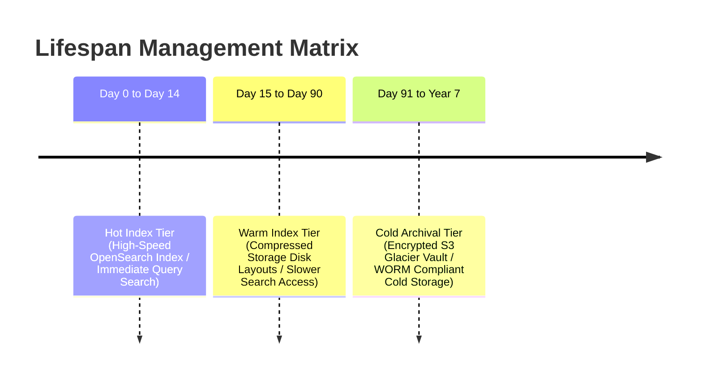

# Log Management Specification

This specification defines the logging architecture, ingestion formats, serialization standards, data-scrubbing rules and audit retention policies for the HeadStart digital ecosystem. It guarantees that applications across the NextJS and Expo mobile architectures emit structured telemetry that ensures complete visibility while maintaining the security boundaries of your database prefixes (`iam_*`, `lms_*`, `crm_*`, `erp_*`, `scm_*`, `bil_*`).

## 1. System Logging Architecture

To ensure decoupling and fault-tolerant log gathering without adding performance overhead to application worker processes, HeadStart implements an asynchronous, structured aggregation pipeline : 



### 1.1 Transmission Mechanisms

- **Containerized Services (Backend / Web)** : Application runtimes must exclusively write log messages to standard output (`stdout`) and standard error (`stderr`) streams as single-line serialized JSON objects. Avoid writing log files directly inside container layers.

- **Mobile Clients (Expo)** : The mobile application buffers diagnostic logs in an internal encrypted SQLite cache. It flushes these logs to the API gateway collector via an encrypted HTTPS POST batch payload when network states are favorable.

- **Log Forwarding (Vector)** : An independent sidecar daemon collects streaming standard output streams, applies format parsing constraints, handles local memory queuing during downstream network anomalies and forwards payloads down to the centralized message bus.

---

## 2. Structured Log Format (JSON Schema Invariant)

Every log trace emitted within the HeadStart system must rigidly conform to a uniform JSON schema layout. This uniformity enables structural parsing and high-speed indexing across the monitoring stack.

```json
{
  "$schema": "https://json-schema.org/draft/2020-12/schema",
  "title": "HeadStartUnifiedLogEnvelope",
  "type": "object",
  "required": ["timestamp", "log_id", "severity", "service_name", "environment", "trace_id", "message"],
  "properties": {
    "timestamp": { "type": "string", "format": "date-time" },
    "log_id": { "type": "string", "format": "uuid" },
    "severity": { "type": "string", "enum": ["DEBUG", "INFO", "WARN", "ERROR", "FATAL"] },
    "service_name": { "type": "string" },
    "environment": { "type": "string", "enum": ["development", "staging", "production"] },
    "trace_id": { "type": "string" },
    "span_id": { "type": "string" },
    "user_id": { "type": "string", "nullable": true },
    "domain_prefix": { "type": "string", "enum": ["iam", "lms", "crm", "erp", "scm", "bil", "sys"] },
    "message": { "type": "string" },
    "context": { "type": "object" },
    "exception": {
      "type": "object",
      "properties": {
        "error_class": { "type": "string" },
        "stack_trace": { "type": "string" }
      }
    }
  }
}
```

### 2.1 Operational JSON Payload Example

```json
{
  "timestamp": "2026-07-07T15:10:42.194Z",
  "log_id": "0190a3c2-4510-7001-a123-bcde555555ab",
  "severity": "ERROR",
  "service_name": "billing-service",
  "environment": "production",
  "trace_id": "amzn-w3-0190a3c2-4510-7001-b999",
  "span_id": "8f3b20a109e5",
  "user_id": "0190a3c2-4510-7001-a123-bcde456789ab",
  "domain_prefix": "bil",
  "message": "Webhook transaction processing failed due to signature verification mismatch.",
  "context": {
    "gateway_provider": "bKash",
    "attempt_count": 1,
    "client_ip": "103.231.162.2"
  },
  "exception": {
    "error_class": "SignatureVerificationException",
    "stack_trace": "Traceback (most recent call last):\n  File \"/app/billing/webhooks.py\", line 42, in verify\n    raise SignatureVerificationException(\"HMAC token mismatch\")"
  }
}
```

---

## 3. Data Scrubbing, Masking & Sensitive Data Restrictions

To ensure strict adherence to international compliance frameworks and protect sensitive information, telemetry collection must implement defensive boundary filters before serialization occurs.

### 3.1 Hard Restrictions : Never Log

The following information must never be committed to text log messages, local cache files or distributed diagnostic streams under any circumstances : 

- Plaintext credentials, session keys, authentication nonces or raw bearer tokens (`iam_session.token_hash` inputs).

- Plaintext payment card details (PAN, CVV, Expiration Dates) or mobile banking personal identification numbers (PINs).

- Sensitive personal identifiable information, such as exact physical home addresses or governmental ID registration strings.

### 3.2 Automated In-Transit Data Masking Rules

Log pipeline interceptors apply regular expression filtering scripts to intercept, mask or nullify highly sensitive parameters. If a matching key path or naming convention pattern is detected, the runtime engine updates the text allocation string : 



| Target Regex Key Pattern | Applied Mitigation Mechanism | Transformed Runtime Output Representation |
| :--- | :--- | :--- |
| `(?i)(password\|secret\|token\|auth_key)` | Complete Substitution | `password": "[REDACTED]` |
| `(?i)(card_num\|account_pin\|cvv)` | Absolute Truncation | `card_num": "XXXX-XXXX-XXXX-4242` |
| `(?i)(national_id\|passport_num)` | Cryptographic Hashing | `national_id": "sha256:8f92b...c3a8` |

---

## 4. Severity Matrix & Alerting Invariants

HeadStart uses five explicit log severity vectors to classify diagnostic data. These levels determine how operations teams are notified when system anomalies occur.

### 4.1 Severity Classification Table

| Severity | Definition / System State Trigger                                                                              | Target Routing Target              | Notification Channel Action                                            |
|----------|----------------------------------------------------------------------------------------------------------------|------------------------------------|------------------------------------------------------------------------|
| DEBUG    | High-verbose diagnostic metrics regarding internal execution states.                                           | Standard Log Storage Only          | Completely suppressed in production cluster runtimes.                  |
| INFO     | Routine lifecycle changes (*Example* : successful enrollment operations).                                            | Storage & Query Indexes            | No operational notification alerts dispatched.                         |
| WARN     | Non-breaking operational degradation anomalies (*Example* : API retry loops).                                        | Storage & Diagnostic Alerts        | Aggregated daily inside operational dashboard reports.                 |
| ERROR    | A localized transaction loop fails to complete successfully (*Example* : webhook signature failures).                | Error Tracking Engine + OpenSearch | Emits real-time diagnostic alerts to engineering team channels.        |
| FATAL    | System-wide component failures or catastrophic infrastructure drops (*Example* : lost database cluster connections). | High-Priority Pager Infrastructure | Immediate multi-channel escalation calls to on-call engineering leads. |

---

## 5. Storage Optimization, Retention & Regulatory Compliance

To control log volume inflation and manage infrastructure costs while meeting auditing requirements, logging setups use a tiered data retention strategy.

### 5.1 Lifespan Management Matrix



### 5.2 Storage Lifecycle Strategy

- **Tier 1** : **Hot Storage (0–14 Days)** : Log records are retained within high-performance clusters to support real-time querying, automated metric dashboard rendering and diagnostic troubleshooting.

- **Tier 2 : Warm Storage (15–90 Days)** : Logs are moved out of active indexes and stored on compressed disk arrays. This maintains historical visibility for general investigation pipelines while reducing operational resource costs.

- **Tier 3 : Cold Storage Archival (91 Days–7 Years)** : Logs are exported to compressed, encrypted storage buckets. These archives are configured with continuous Write-Once-Read-Many (WORM) constraints to meet regulatory compliance requirements and preserve tamper-proof transactional records.