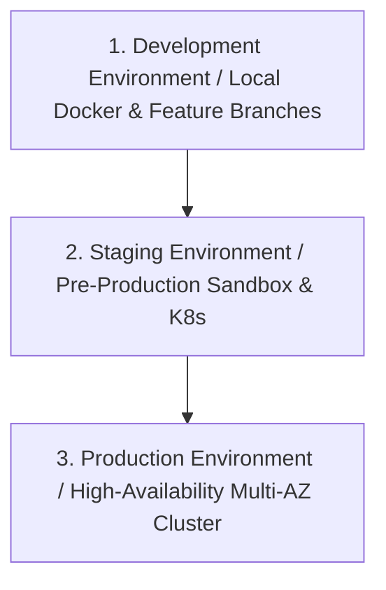
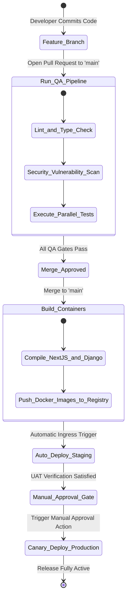
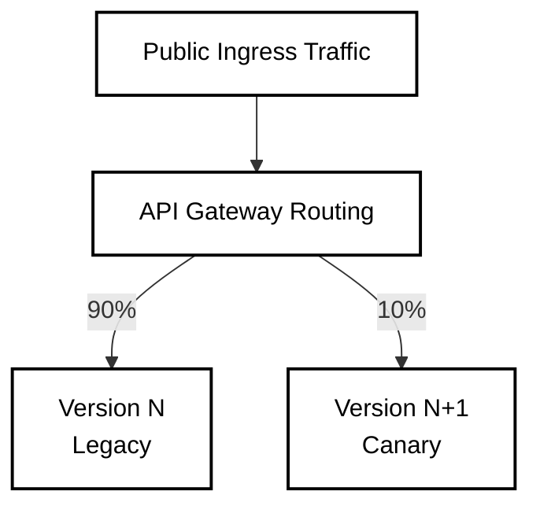

# Release / Deployment Design Specification

This specification outlines the deployment topology, environment stratification, continuous delivery pipeline configuration, database migration strategies and rollback automation protocols for the HeadStart digital ecosystem. It guarantees high availability and zero-downtime releases while enforcing the isolation boundaries of the schema domains (`iam_*`, `lms_*`, `crm_*`, `erp_*`, `scm_*`, `bil_*`).

## 1. Environment Stratification & Infrastructure Topology

To isolate experimental logic and validate configurations safely before hitting production layers, HeadStart maintains three distinctly provisioned staging layers : 

### 1.1 Development Environment (`dev`)

- **Infrastructure Layout** : Localized `docker-compose` orchestration running on engineer machines, mimicking container runtimes.

- **Data Tier** : Ephemeral PostgreSQL containers seeded with structural anonymized mock data pools.

- **Access Scope** : Full administrative read / write authority granted to system developers.

### 1.2 Staging Environment (`staging`)

- **Infrastructure Layout** : A single-zone Kubernetes cluster provisioned on isolated cloud networking subnets. It closely mirrors production configurations.

- **Data Tier** : A managed PostgreSQL instance populated with dynamically sanitized, masked production data sets to protect real-user privacy.

- **Access Scope** : Limited read-only visibility for internal engineering validation and automated continuous integration runners.

### 1.3 Production Environment (`production`)

- **Infrastructure Layout** : A multi-Availability Zone (multi-AZ) Kubernetes cluster deployed behind a highly available, redundant API Gateway layer.

- **Data Tier** : High-performance, multi-AZ replicated PostgreSQL cluster utilizing strict operational storage boundaries.

- **Access Scope** : Severely locked down. No direct human write permissions. System modifications are exclusively executed by authenticated service accounts via cryptographic deployment automation workflows.

---

## 2. Continuous Integration & Continuous Deployment (CI / CD) Workflow

HeadStart utilizes a automated GitHub Actions continuous distribution engine to coordinate release gates.

### 2.1 Code Promotion Rules & Operational Controls

- **Triggers** : Commits pushed to independent feature branches automatically execute the QA Pipeline Gate (Linting, static code audits and parallelized unit / integration testing blocks).

- **Branch Protections** : The `main` branch enforces strict compliance rules. Direct pushes are structurally blocked. Merges require an approved Pull Request matching code coverage targets ($\ge 90\%$ unit coverage).

- **Artifact Generation** : Merges into `main` trigger container building actions. Runtimes pass through optimized multi-stage Docker builds, tagging output images using explicit, immutable Git commit SHA strings.

---

## 3. Database Migration Strategy (Zero-Downtime Releases)

Because the HeadStart ecosystem couples modern software runtimes with strict relational database constraints, schema changes must be broken down into multi-stage operations to prevent service interruptions or table locks.

### 3.1 Strict Anti-Disruption Rules

- **Destructive Constraints** : Destructive database actions—such as dropping columns, renaming existing schema entities or altering field precision parameters (`NUMERIC(12, 2)` configurations)—must **never** be executed within a single deployment pass.

- **Backward Compatibility Invariant** : Database migrations must remain fully backward-compatible with the immediately preceding application version code ($N-1$). This allows legacy and modern application pods to access the data layer concurrently during rolling production updates.

### 3.2 Multi-Phase Schema Alteration Lifecycle

When executing database mutations, engineers must use the Expand and Contract Pattern : 

| Execution Phase     | Target Database Scope Action                                                                                                    | Application Code Tracking State                                                                                                |
|---------------------|---------------------------------------------------------------------------------------------------------------------------------|--------------------------------------------------------------------------------------------------------------------------------|
| **Phase 1 : Expand**     | Add the new structural target column or entity via `ALTER TABLE` (ensuring it is set to `NULLABLE` to avoid execution lock blocks). | The application layer reads exclusively from the legacy column but safely writes duplicate states to both fields concurrently. |
| **Phase 2 : Backfill**   | Execute an asynchronous script to backfill data into the new column in batches, preventing table locks.                         | The application layer continues normal dual-writing behavior.                                                                  |
| **Phase 3 : Transition** | Apply necessary structural check constraints or `NOT NULL` validations to the new column layout.                                  | Flip the application configuration path to read and write exclusively from the new schema field.                               |
| **Phase 4 : Contract**   | Deploy a subsequent migration script that safely drops the legacy, unused column from the database namespace.                   | The older application codebase version is fully decommissioned from the running environment.                                   |

---

## 4. Production Release Strategies & Ingress Routing

To protect high-frequency transactions — such as token processing paths inside `iam_session` — production updates utilize **Canary Deployments** managed by the API Gateway ingress layer.

### 4.1 Canary Distribution Rules

- **Initial Ingress Routing Boundary** : The API Gateway paths intercept user requests and routing protocols, directing 90% of active ingress traffic to the stable production version ($N$) while routing exactly 10% to the newly deployed canary pods ($N+1$).

- **Telemetry Profiling Evaluation Windows** : Automated tracking services closely monitor performance health indicators for 30 minutes. If error metrics spikes occur or latency targets are breached ($p99 \le 50\text{ms}$ updates), the system halts rollout logic.

- **Linear Progression Enforcements** : If metrics remain healthy, traffic allocations scale incrementally (*Example* : to 25%, 50% and eventually 100%). Legacy containers are then safely spun down.

---

## 5. Automated Rollback & Recovery Protocols

If an unexpected error escapes staging pipelines and triggers production anomalies, the environment architecture executes a rapid recovery sequence.

### 5.1 Automated Rollback Invariants

- **Failure Monitors** : Ingress routing layers watch automated monitoring bounds. A rollback loop is instantly triggered if : 

  - The platform error rate thresholds cross $\ge 1\%$ of total system requests within a rolling 60-second window.

  - catastrophic, infrastructure-level runtime crashes occur (*Example* : containers continuously fail health checks and enters crash loops).

- **Zero-Downtime Rollback Execution** : The deployment controller reverts container version tags in reverse order. Because migrations maintain backward compatibility, traffic immediately shifts back to the stable version without data loss or service degradation.

- **Post-Mortem Sandbox Isolation** : Faulty container instances are decoupled from the active routing pool but left running in an isolated sandbox namespace for 15 minutes. This allows operations teams to collect memory dumps and diagnostic stack traces before the containers are fully terminated.