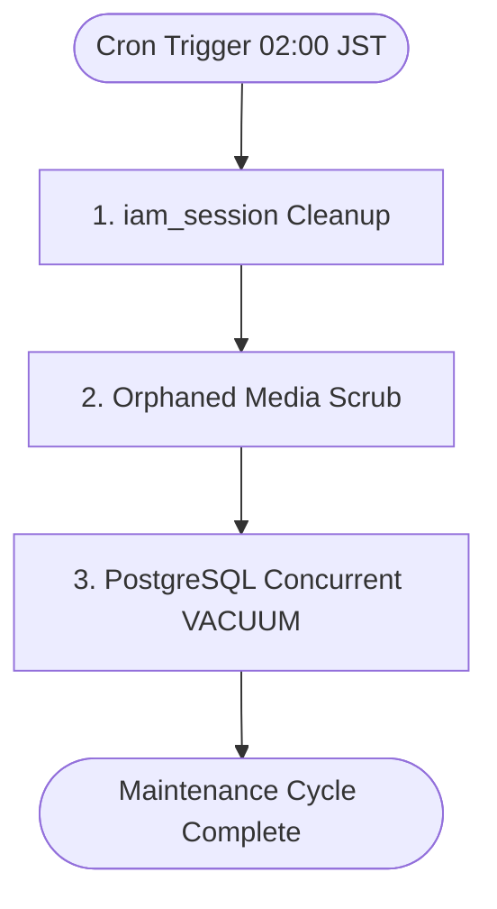
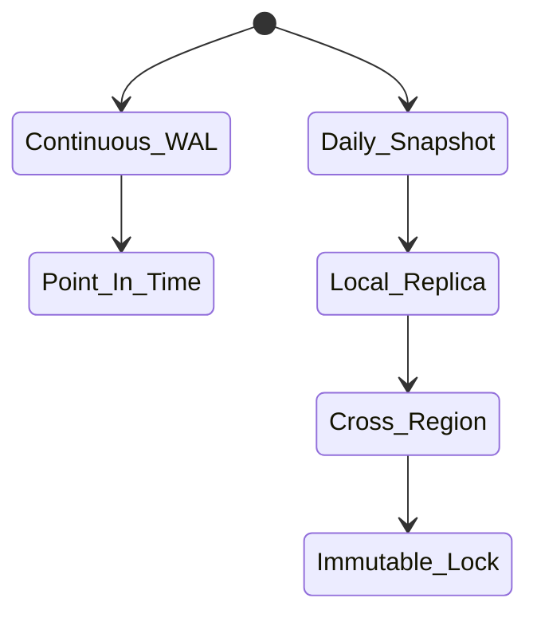

# Operational Maintenance Specification

This specification defines the day-to-day runbooks, automated cleanup routines, infrastructure scaling invariants, disaster recovery protocols and routine patching cycles for the HeadStart digital ecosystem. It guarantees ongoing platform reliability, storage cost efficiency and system durability across all services operating over your core database prefixes (`iam_*`, `lms_*`, `crm_*`, `erp_*`, `scm_*`, `bil_*`).

## 1. Automated System Maintenance & Cleanup Routines

To prevent storage bloat and performance degradation, the infrastructure architecture executes a series of decoupled background maintenance operations. These routines run during low-traffic windows ($02:00 \text{ – } 04:00 \text{ JST}$) to ensure zero user-facing impact.

### 1.1 Periodic Database & Cache Purging

- **Session Pruning** : An automated task runs nightly to delete expired tokens from `iam_session` entities. Active sessions exceeding a rolling 30-day inactivity threshold are soft-deactivated and their database records are moved to an analytical historical archive.

- **Orphaned Asset Scavenging** : A monthly background worker scans the `scm_*` (Supply Chain / Media Assets) reference links in the database, matching them against physical files stored in storage buckets. Any asset file lacking a relational record in the database for $\ge 14\text{ days}$ is automatically deleted to control storage volume inflation.

- **Database Table Optimizations** : The transactional PostgreSQL engine executes a concurrent `VACUUM ANALYZE` operation weekly on high-throughput database entities (such as `bil_transaction` maps) to reclaim dead tuple disk allocations and refresh index statistics without locking tables.

---

## 2. Infrastructure Auto-Scaling Invariants

To handle sudden spikes in user load—such as enrollment surges inside the `lms_*` modules or incoming billing webhooks — the container runtime utilizes horizontal pod auto-scaling frameworks.

### 2.1 Dynamic Scale Policies

| Application Layer Tier       | Primary Scaling Metric Threshold          | Action Vector / Invariant Rules                                          |
|------------------------------|-------------------------------------------|--------------------------------------------------------------------------|
| **NextJS Web / App Router**     | Target Average Memory Usage $\ge 75\%$    | Instantly spin up $+1$ replica pod (*Minimum* : 3, *Maximum* : 30 instances).  |
| **Django API / Core Services**   | Target Average CPU Utilization $\ge 70\%$ | Instantly spin up $+2$ replica pods (*Minimum* : 2, *Maximum* : 20 instances). |
| **Background Message Consumers** | Event Queue Depth $\ge 5,000 \text{ messages}$ | Increment consumer instances linearly until processing equilibrium is achieved. |

---

## 3. Disaster Recovery (DR) & Backup Strategies

HeadStart enforces an absolute data loss protection layout to defend against critical hardware failure or multi-region infrastructure disruptions.

### 3.1 The Backup Lifecycle Engine

### 3.2 Backup Execution Details

- **Continuous Transaction Logs** : Database transactional engines stream Write-Ahead Logs (WAL) continuously to an isolated cloud storage bucket. This enables granular Point-in-Time Recovery (PITR) to any millisecond boundary within a rolling 35-day retention window.

- **Daily Snapshots** : Full encrypted physical database backups execute every 24 hours at $03:00\text{ JST}$. These snapshots are automatically replicated across an independent cloud region and locked using Write-Once-Read-Many (WORM) immutability settings to prevent tampering or accidental deletion.

- **Recovery Objective Metrics** : The platform recovery framework is explicitly tuned to meet strict business continuity targets : 

  - **Recovery Point Objective (RPO)** : $\le 5\text{ minutes}$ (Maximum potential data loss during a catastrophic outage).

  - **Recovery Time Objective (RTO)** : $\le 15\text{ minutes}$ (Maximum allowable duration to restore full operational service).

---

## 4. Periodic Patching & Dependency Upgrades

To maintain a secure software posture, system dependencies are systematically evaluated and updated to eliminate security drift.

### 4.1 Vulnerability Monitoring & Update Cadences

- **Automated Security Alerts** : Integrated code scanners continuously analyze runtime environments for CVE disclosures. Vulnerabilities classified as **Critical** require the immediate generation of an automated patch branch. These must be deployed to production through the standard CI / CD pipeline within 24 hours.

- **Routine Component Synchronization** : Minor and patch-level updates for underlying frameworks (such as NextJS, Django and Expo packages) are scheduled for evaluation on every week.

- **Major Architecture Upgrades** : Upgrades involving major framework versions are isolated to dedicated technical debt sprints. These require comprehensive integration and component testing validation layers before they can be considered for production staging.

---

## 5. Routine Runbooks & Emergency Drills

### 5.1 Game-Day Chaos Simulations

- **Infrastructure Failure Drills** : Operations teams execute semi-annual "Game-Day" disaster simulations. These structured exercises involve intentionally terminating primary multi-AZ database nodes or simulating regional network blackouts to verify that automated failover mechanisms engage as designed.

- **Backup Integrity Audits** : Every 90 days, automated recovery runners spin up an ephemeral clone of the system infrastructure using a randomized historical snapshot. The runner then executes the complete integration test suite to verify data consistency and confirm that restoration files are fully functional.

### 5.2 Emergency Contacts & Escalate Protocols

- **Automated Trigger Ingress** : If a **P1 : Critical** infrastructure event or system outage occurs, the automated alerting system opens an incident ticket and simultaneously pages the on-call engineering lead via phone and secure text channels.

- **Incident Room Initiation** : A secure video bridges and dedicated chat channels are automatically launched to serve as the central coordination hub for remediation efforts.

- **Status Communication Routine** : During an active P1 incident, the engineering lead must publish clear updates to internal team dashboards every 15 minutes. These updates outline current findings, remediation progress and estimated resolution timelines.