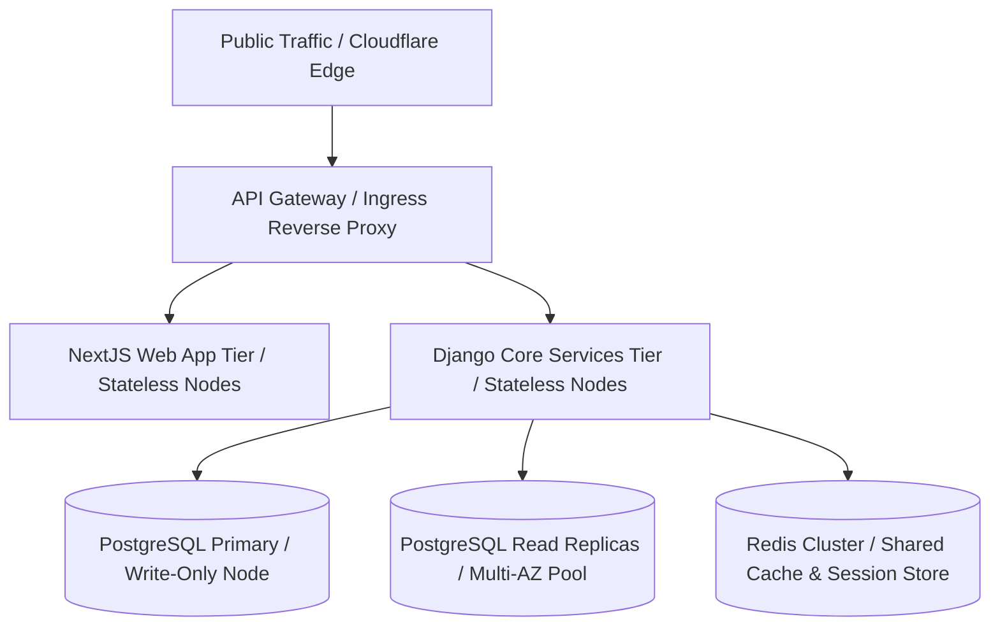
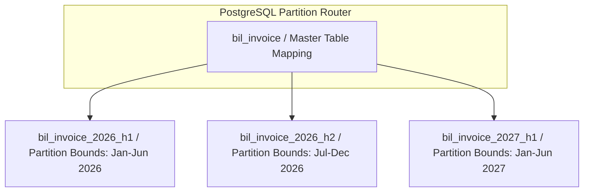
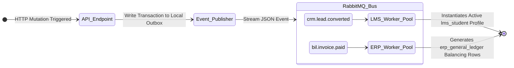

# Scalability Consideration Specification

This specification defines the architectural vectors, system sizing strategies, data partitioning patterns and caching mechanics for the HeadStart digital ecosystem. It ensures linear performance scaling and structural availability under high load conditions while preserving the isolation boundaries of the system’s primary schema domains (`iam_*`, `lms_*`, `crm_*`, `erp_*`, `scm_*`, `bil_*`).

## 1. Architectural Scaling Invariants & Stratification

To scale the platform linearly without creating resource contention or state bloat, HeadStart implements an isolated, multi-tiered infrastructure layers model : 

### 1.1 Stateless Application Node Scaling

- **NextJS Web Tier** : The NextJS web application serves as a stateless layout engine. All frontend routing configurations, server-side page structures, and presentation components are detached from local execution states. Nodes scale horizontally based on active traffic parameters.

- **Django API Services** : Python / Django backend engines process operations by fetching execution contexts on-demand from the centralized data layers. Local application state caching is strictly prohibited inside container runtimes to guarantee arbitrary horizontal scaling properties.

### 1.2 Data and Caching Stratification

- **Shared Cache Layer** : All volatile state, authentication records via `iam_session`, rate-limiting tracking metrics, and transient performance buffers are abstracted to a distributed Redis Cluster.

- **Database Isolation Boundaries** : High-performance read operations are offloaded to an horizontally scaled multi-AZ pool of PostgreSQL read replicas, insulating the master database engine from performance drops during reporting or analytical heavy operations.

---

## 2. High-Capacity Database Partitioning & Read / Write Sharding

As transactional domains like `bil_*` and `lms_*` grow over multi-year horizons, HeadStart implements advanced database partitioning strategies within the PostgreSQL engine to avoid processing delays and long-tail query performance deterioration.

### 2.1 Horizontal Data Partitioning Architecture

### 2.2 Entity-Level Partitioning Layouts

- **Time-Series Range Partitioning** : Transaction records like `bil_invoice` and `bil_transaction` are horizontally partitioned using range limits based on creation timestamps (`created_at`). Data is organized into semi-annual physical table buckets (*Example* : `bil_invoice_2026_h2`), protecting indexing structures from depth bloat.

- **Hash-Based Partitioning** : High-density relational components — including active user profiles in `lms_student` and tracking indices — are split into multiple physical storage partitions via modulo hash logic applied directly to their `UUIDv7` primary keys. This evenly balances file I/O operations across physical storage arrays.

---

## 3. High-Performance Distributed Caching Topology

To maintain low latency response targets where $p99 \le 50\text{ms}$ during massive spikes in load, the system relies on a multi-layered distributed caching model.

### 3.1 Caching Tiers & Eviction Management

| Cache Strategy Profile    | Target Architectural Namespace Scope       | Eviction Policy           | Maximum Retention Lifetime Bounds (TTL)     |
|---------------------------|--------------------------------------------|---------------------------|---------------------------------------------|
| **Edge Cache / CDN**          | Public Static Catalog Layouts & Assets     | Least Recently Used (LRU) | 14 Days (Hard Cache-Control Enforcements)   |
| **Distributed Cache (Redis)** | Serialized Core Course Catalog Data        | Volatile LRU              | 24 Hours (Explicit Background Invalidation) |
| **Session Cache (Redis)**     | Active Security State Tokens (`iam_session`) | Absolute Expiration       | 30 Days (Direct Sync with `expires_at`)       |

### 3.2 Cache Invalidation & Consistency Protocols

- **Write-Through Pattern** : Updates to high-read entities (such as updating public course pricing matrices) alter the primary database tables first inside a local transaction block, then immediately write the transformed state into the Redis Cluster before completing the response loop.

- **Asynchronous Cache Purging** : Complex data transformations — such as modifying layout maps or academic structures — leverage RabbitMQ event brokers. Downstream micro-workers consume these messages asynchronously and remove stale cached keys across the engine array, preventing split-brain runtime conditions.

---

## 4. Concurrent Queue Architecture & Asynchronous Event Processing

To scale compute intensive workflows (*Example* : student lead conversions, billing calculations and notifications) without causing service interruptions, HeadStart decouples long-running operations using asynchronous message workers.

### 4.1 Message Queue Design Rules

- **Guaranteed At-Least-Once Delivery** : Publishers leverage the Transactional Outbox Pattern within native PostgreSQL transaction sequences to guarantee that background event payloads are reliably delivered to the message bus.

- **Idempotency Invariants** : Event consumers are strictly designed to maintain absolute idempotency. Consumers process incoming JSON data payloads by passing the unique tracking ID (`event_id`) through a persistent deduplication registry, preventing duplicate calculations or execution logic from running twice.

---

## 5. Storage Scaling Optimization & Archival Policy

Because the continuous aggregation of system logs, transactional history and rich media profiles increases resource demands, the data layer architecture applies tiered storage compression schemes over historical data.

### 5.1 Storage Lifecycle Architecture

- **Active Dynamic Tier (PostgreSQL / Hot Indexes)** : Stores high-velocity, real-time metrics spanning the most recent 90-day execution window. Database instances utilize high-speed Solid-State Drive arrays to maximize query throughput.

- **Historical Archive Tier (Cold Database Storage)** : Records older than 90 days—including processed invoices and transferred to cold storage. These records remain accessible via slow query interfaces for compliance verification while minimizing primary database infrastructure expenses.